# gemini-skill

A Claude Code skill for broad Gemini REST API access — text generation, multimodal input, image/video/music generation, embeddings, caching, batch processing, search grounding, code execution, file search, and more.

## Quick Start

1. **Clone the repository**
   ```bash
   git clone https://github.com/reshinto/gemini-skill.git
   cd gemini-skill
   ```

2. **Install the skill** (creates venv, pip-installs `google-genai==1.33.0`, merges settings)
   ```bash
   python3 setup/install.py
   ```
   The installer:
   - Copies operational files to `~/.claude/skills/gemini/`
   - Creates `~/.claude/skills/gemini/.venv` with pinned `google-genai`
   - Verifies install integrity via SHA-256 checksums
   - Prompts for Gemini API key (hidden input)
   - Merges env block into `~/.claude/settings.json` (with conflict resolution)

3. **Set your Gemini API key** (get one at [aistudio.google.com/apikey](https://aistudio.google.com/apikey))

   The installer prompts you interactively. If you need to manually edit, add/update the `env` block in `~/.claude/settings.json`:
   ```json
   {
     "env": {
       "GEMINI_API_KEY": "AIzaSy...",
       "GEMINI_IS_SDK_PRIORITY": "true",
       "GEMINI_IS_RAWHTTP_PRIORITY": "false",
       "GEMINI_LIVE_TESTS": "0"
     }
   }
   ```
   Claude Code injects these values into the process env at session start.

   **Do NOT edit the repo-root `.env`** — that's only for local development from a clone. For the installed skill, use `~/.claude/settings.json` exclusively.

4. **Fully restart Claude Code** (⌘Q on macOS, not "Reload Window"). Skill discovery and env injection happen at IDE launch.

5. **Use it in Claude Code**
   ```
   /gemini text "Explain quantum computing"
   ```

## Architecture



## Features

- Text generation, multimodal input, structured output, function calling
- Image generation (Nano Banana, Imagen 3), video generation (Veo), music generation (Lyria 3)
- Embeddings, context caching, batch processing, token counting
- Google Search grounding, Google Maps grounding, code execution
- File API, File Search / hosted RAG
- Deep Research (Interactions API), Computer Use (preview)
- Live API realtime sessions (async dispatch)
- Automatic model routing by task type and complexity
- Two-phase cost tracking (pre-flight estimate + post-response)
- Multi-turn conversation sessions with Gemini
- Dual transport backend — google-genai SDK primary + urllib raw HTTP fallback, user never picks

## Prerequisites

- Python 3.9+
- A Gemini API key
- `google-genai==1.33.0` (installed automatically by `setup/install.py` into `~/.claude/skills/gemini/.venv`)

## Documentation

See [docs/](docs/) for full documentation including:
- [Architecture](docs/architecture.md) — System design and module layout
- [How It Works](docs/how-it-works.md) — End-to-end execution trace
- [Installation](docs/install.md) — Setup, troubleshooting, API key configuration
- [Commands](docs/commands.md) — Command index by capability family
- [Capabilities](docs/capabilities.md) — Feature overview with status and limitations
- [Model Routing](docs/model-routing.md) — Router decision tree and model selection
- [Security](docs/security.md) — Threat model, auth, data protection
- [Usage](docs/usage.md) — Getting started and common workflows
- [Testing](docs/testing.md) — Running tests, writing tests, coverage, live API smoke tests
- [Python Design](docs/python-guide.md) — Stdlib-only architecture, Python 3.9+ floor
- [Contributing](docs/contributing.md) — Adding adapters, code style, PRs
- [Update & Sync](docs/update-sync.md) — Install mechanism, rollback, registry updates

See also:
- [Per-command reference](reference/index.md) — Detailed docs for all 21 commands

## Backends

By default, the skill uses the **google-genai SDK as the primary backend**, with **urllib raw HTTP as the fallback**. Both backends return identical response shapes via the `normalize` layer — adapters never know which ran.

To invert backend priority (raw HTTP primary, SDK fallback), edit `~/.claude/settings.json`:
```json
{
  "env": {
    "GEMINI_IS_SDK_PRIORITY": "false",
    "GEMINI_IS_RAWHTTP_PRIORITY": "true"
  }
}
```

Restart Claude Code. Both flags cannot be false (ConfigError), and if both are true, SDK wins.

## License

MIT
