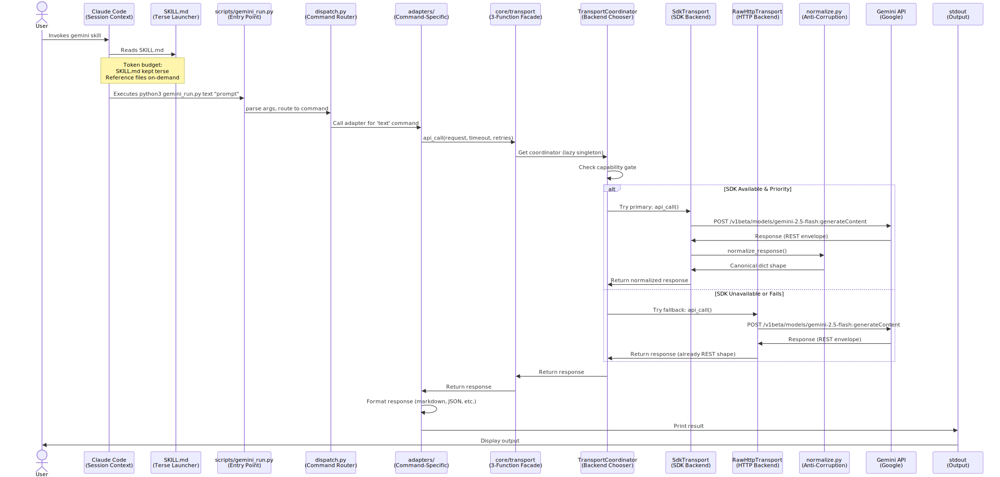

# Architecture

[← Back to README](../README.md) · [Docs index](README.md) · [Reference index](../reference/index.md)

---

**Last Updated:** 2026-04-14

## System Overview

The gemini-skill is a Claude Code skill providing REST API access to Google
Gemini. It uses a dual-backend transport layer (SDK primary, raw HTTP fallback)
with modular adapters and policy enforcement.

There are now two supported install entry points:

- `setup/install.py` for source checkouts and release tarballs
- `gemini-skill-install` for `uvx` / `pipx` bootstrap installs

Both delegate to the same install core and shared payload manifest.

## Why SKILL.md Is Terse

The `SKILL.md` file (gemini-skill's manifest in Claude Code) is intentionally minimal: ~1 KB, three quick-start commands, and a pointer to the full reference. This design reflects a core principle: **token budgets matter at scale**.

**The Token Economics:**

When a user starts a VSCode session, Claude Code auto-loads SKILL.md into context. That file is read _once_ and stays in context for the entire session. Here's the cost:

- A typical SKILL.md today: ~1 KB = ~300 tokens
- A verbose SKILL.md with full command catalog: ~10 KB = ~3,000 tokens
- Across N users, M sessions per day, for a month: massive cumulative cost

Example math: If 100 users run 10 sessions/day for 30 days, and each session runs an average of 2 times, a verbose SKILL.md costs (100 × 10 × 30 × 2 × 2,700 tokens) = 162 million extra tokens per month. A terse SKILL.md costs 16.2 million tokens. That's real money.

**Principle of Least Information:**

SKILL.md is read at session start. The model doesn't know yet whether it will invoke the gemini skill. Why load detailed reference into context for something it might never use?

Instead, SKILL.md says: "The gemini skill does X, Y, Z. For the full command reference, see `reference/index.md` (or specific commands like `reference/text.md`)."

If the model decides to invoke the skill, it reads the specific `reference/<command>.md` file _on demand_. That file (~2–3 KB per command) is loaded only when needed, and only the one command the model is about to invoke.

**How This Actually Works:**

1. **Session start:** Claude Code loads SKILL.md (~300 tokens). Model knows "gemini skill exists, does text/image/video generation" but doesn't see full command details.
2. **Model decides to use gemini:** Model reads `reference/text.md` or `reference/image_gen.md` on demand (~600 tokens total for one command). Model sees full syntax, examples, flags, and edge cases.
3. **Model invokes skill:** Executes the command with flags it just read.

**Result:** A user who runs a gemini skill command in a session loads:

- SKILL.md: ~300 tokens (once at session start)
- Relevant `reference/*.md` file(s): ~600 tokens (loaded only if invoked)
- Total: ~900 tokens

A verbose, all-in-one SKILL.md would cost ~3,000 tokens _just at session start_, before the user even invokes the skill.

**Cross-Reference:** This design mirrors the `Facade Pattern` (see [Design Patterns — Facade Pattern](design-patterns.md#facade-pattern)). Just as the skill's facade hides coordinator complexity behind three simple functions, SKILL.md hides reference complexity behind a terse launcher. Both examples of "minimal surface area at the boundary."

For more details on how token optimization influences architecture

<sub>Source: [`docs/diagrams/token-optimization-flow.mmd`](diagrams/token-optimization-flow.mmd) — regenerate with `bash scripts/render_diagrams.sh`</sub>


<sub>Source: [`docs/diagrams/architecture-dual-backend.mmd`](diagrams/architecture-dual-backend.mmd) — regenerate with `bash scripts/render_diagrams.sh`</sub>


<sub>Source: [`docs/diagrams/command-dispatch-flow.mmd`](diagrams/command-dispatch-flow.mmd) — regenerate with `bash scripts/render_diagrams.sh`</sub>

## Runtime path

This is the end-to-end execution path for a single invocation — the same whether started from Claude Code (`/gemini text "hello"`) or the terminal (`python3 scripts/gemini_run.py text "hello"`).

1. **Entry point** — `scripts/gemini_run.py` receives the subcommand and its arguments.

2. **Env bootstrap** — Before dispatch, the launcher loads runtime configuration from the first match in this lookup order:
   `./.env` → `./.claude/settings.local.json` → `./.claude/settings.json` → `~/.claude/settings.json` → existing process env.
   Only canonical Gemini keys (`GEMINI_API_KEY`, `GEMINI_IS_SDK_PRIORITY`, etc.) are imported into `os.environ`.

3. **Venv re-exec** — If a skill-local virtual environment exists at `.venv/`, the launcher re-execs itself under `.venv/bin/python`. This makes the pinned `google-genai` SDK available without changing the CLI surface.

4. **Dispatch** — `core/cli/dispatch.py` validates the subcommand against `ALLOWED_COMMANDS`, dynamically imports the adapter module via `importlib`, builds its argument parser, applies policy checks (mutating-operation gate, privacy opt-in), then calls `adapter_module.run(**vars(args))`.

5. **Adapter execution** — The adapter validates arguments, resolves a model via the router, constructs the Gemini request, and calls the shared transport facade (`core/transport/__init__.py`).

6. **Transport** — `TransportCoordinator` selects SDK or raw HTTP as primary based on `GEMINI_IS_SDK_PRIORITY` / `GEMINI_IS_RAWHTTP_PRIORITY`, falls back on eligible errors, and returns a backend-agnostic `GeminiResponse` dict. Adapters never know which backend ran.

7. **Output** — Text under 50 KB prints to stdout; larger responses and all media save to files (path printed). Session-enabled commands persist history under `~/.config/gemini-skill/`.

## Directory Layout

```
.
├── SKILL.md                  # Claude Code skill definition (launcher metadata)
├── VERSION                   # Semantic version
├── scripts/
│   ├── gemini_run.py         # Entry point (version check, venv re-exec, dispatch)
│   └── health_check.py       # Health check utility
├── setup/
│   ├── install.py            # Source-checkout launcher, stable-Python guard + install delegation
│   ├── update.py             # Release checker (latest GitHub tag vs installed VERSION)
│   └── requirements.txt      # Pinned google-genai==1.33.0
├── gemini_skill_install/
│   ├── __main__.py           # Packaged bootstrap entry point
│   └── cli.py                # Materialize packaged payload then delegate to install_main
├── pyproject.toml            # PEP 517 build-system metadata
├── setup.py                  # Package metadata + payload bundling for wheel/sdist
├── MANIFEST.in               # Source distribution file manifest
├── core/
│   ├── cli/
│   │   ├── dispatch.py       # Subcommand whitelist, IS_ASYNC detection, policy enforcement
│   │   ├── install_main.py   # Install handler (Phase 5: venv + settings merge)
│   │   ├── update_main.py    # Update/sync handler
│   │   ├── health_main.py    # Health check utility
│   │   └── installer/        # Install submodules (venv, settings_merge, api_key_prompt, legacy_migration)
│   ├── auth/
│   │   └── auth.py           # Resolve API key (GEMINI_API_KEY > .env > error)
│   ├── infra/
│   │   ├── client.py         # Shim re-exporting from core.transport (Phase 1 compat)
│   │   ├── config.py         # Load config (prefer_preview_models, output_dir)
│   │   ├── cost.py           # Track cost with file locking + atomic writes
│   │   ├── errors.py         # API errors, custom exceptions
│   │   ├── checksums.py      # Install-time integrity verification (Phase 4)
│   │   ├── mime.py           # MIME type detection and validation
│   │   ├── sanitize.py       # Safe print (no ANSI injection)
│   │   ├── timeouts.py       # Timeout constants and helpers
│   │   ├── filelock.py       # Cross-platform file locking (fcntl/msvcrt)
│   │   └── atomic_write.py   # Atomic file writes (os.replace + retry)
│   ├── transport/            # Dual-backend facade (Phase 1-8)
│   │   ├── __init__.py       # Public facade (api_call, stream_generate_content, upload_file)
│   │   ├── base.py           # Transport interface (abstract base)
│   │   ├── coordinator.py    # TransportCoordinator (primary/fallback dispatch + capability gate)
│   │   ├── policy.py         # Fallback eligibility rules (error classification)
│   │   ├── normalize.py      # Unified GeminiResponse envelope (both backends)
│   │   ├── _validation.py    # Input validation helpers
│   │   ├── sdk/
│   │   │   ├── __init__.py
│   │   │   ├── client_factory.py  # google-genai SDK client instantiation
│   │   │   ├── transport.py       # SdkTransport sync API wrapper
│   │   │   └── async_transport.py # SdkAsyncTransport async API wrapper (Phase 6)
│   │   └── raw_http/
│   │       ├── __init__.py
│   │       ├── client.py          # urllib HTTP client (no SDK dependency)
│   │       └── transport.py       # RawHttpTransport sync API wrapper
│   ├── routing/
│   │   ├── router.py         # Model selection logic
│   │   └── registry.py       # Load model registry (JSON) from registry/
│   ├── state/
│   │   ├── session_state.py  # Multi-turn conversation storage
│   │   ├── file_state.py     # Files API tracking (48hr expiry)
│   │   └── store_state.py    # File Search store state
│   └── adapter/
│       ├── helpers.py        # Shared: build_base_parser, emit_output, check_dry_run
│       └── contract.py       # Adapter interface (get_parser, run, IS_ASYNC flag)
├── adapters/
│   ├── generation/
│   │   ├── text.py           # Text generation + sessions
│   │   ├── multimodal.py     # Files + text (inline base64)
│   │   ├── structured.py     # JSON schema output
│   │   ├── streaming.py      # SSE streaming
│   │   ├── imagen.py         # Imagen 3 text-to-image (Phase 7)
│   │   └── live.py           # Live API realtime sessions (async, Phase 7)
│   ├── data/
│   │   ├── embeddings.py     # Vector embeddings
│   │   ├── token_count.py    # Token counting
│   │   ├── files.py          # Files API (upload/list/get/delete + download subcommand Phase 8)
│   │   ├── cache.py          # Context caching (create/list/get/delete)
│   │   ├── batch.py          # Batch jobs (create/list/get/cancel)
│   │   └── file_search.py    # Hosted RAG (create/upload/query/list/delete)
│   ├── tools/
│   │   ├── function_calling.py  # Tool/function calling
│   │   ├── code_exec.py         # Sandboxed code execution
│   │   ├── search.py            # Google Search grounding (+ --show-grounding flag Phase 8)
│   │   └── maps.py              # Google Maps grounding
│   ├── media/
│   │   ├── image_gen.py      # Image generation (Nano Banana + --aspect-ratio/--image-size Phase 8)
│   │   ├── video_gen.py      # Video generation (Veo)
│   │   └── music_gen.py      # Music generation (Lyria 3)
│   └── experimental/
│       ├── computer_use.py   # Computer use (preview)
│       └── deep_research.py  # Deep Research via Interactions API
├── registry/
│   ├── models.json           # Available models and capabilities
│   └── capabilities.json     # Feature flags, deprecations
├── docs/
│   ├── architecture.md       # This file
│   ├── install.md            # Setup instructions
│   ├── commands.md           # Command index
│   ├── capabilities.md       # Feature overview
│   ├── model-routing.md      # Router decision tree
│   ├── security.md           # Threat model
│   ├── usage.md              # Getting started
│   ├── testing.md            # Test suite
│   ├── python-guide.md       # Python 3.9+ choices
│   ├── contributing.md       # Extension guide
│   └── update-sync.md        # Install mechanism
├── reference/
│   ├── index.md              # Command reference index
│   └── *.md                  # Per-command docs (21 files, one per adapter)
├── tests/                    # 574+ tests, 100% coverage
├── .coverage                 # Coverage data
└── .env.example              # Local-dev template (repo root, contributors only)
```

## The Lean-Router Pattern

The `dispatch.py` module implements a **policy-enforcing dispatcher** that pre-approves certain operations:

1. **Whitelist by default:** Only commands in `ALLOWED_COMMANDS` can run.
2. **Per-adapter parser:** Each adapter defines its own argument parser (via `get_parser()`).
3. **Centralized enforcement:**
   - Flag validation
   - Mutating operation gating (`--execute` required)
   - Dry-run mode for safety
   - Input sanitization

The dispatcher is intentionally **lean** — it doesn't implement business logic. Instead:

- Adapters are **single-responsibility:** one adapter per command.
- Each adapter has a `get_parser()` and `run(**kwargs)` function.
- Adapters are imported dynamically via `importlib.import_module()`.
- The router (`core/routing/router.py`) handles model selection, not dispatch.

This design makes it easy to add new commands: implement a new adapter, add an entry to `ALLOWED_COMMANDS`, and you're done.

## Adapter Lifecycle

1. **Dispatcher invokes adapter:**

   ```python
   adapter_module = importlib.import_module(ALLOWED_COMMANDS[command])
   parser = adapter_module.get_parser()
   args = parser.parse_args(remaining)
   adapter_module.run(**vars(args))
   ```

2. **Adapter execution:**
   - Load config (auth, preferences)
   - Resolve model via router
   - Validate inputs
   - Call `api_call()` (HTTP wrapper)
   - Emit output or save to file

3. **Output handling:**
   - Text < 50KB → stdout
   - Text >= 50KB → file (return path only)
   - Media → always file
   - JSON → pretty-printed to stdout

## Model Routing

The `Router` class implements a two-tier decision tree:

1. **Specialty tasks** route to dedicated models:
   - `embed` → `gemini-embedding-2-preview`
   - `image_gen` → `gemini-3.1-flash-image-preview` (Nano Banana 2)
   - `video_gen` → `veo-3.1-generate-preview`
   - `music_gen` → `lyria-3-clip-preview`
   - `computer_use` → Computer-use specialist
   - `file_search`, `maps` → specialized endpoints

2. **General tasks** (text, multimodal, code_exec, etc.) use complexity-based routing:
   - **High complexity:** `gemini-2.5-pro` (reasoning)
   - **Medium complexity:** `gemini-2.5-flash` (default, balanced)
   - **Low complexity:** `gemini-2.5-flash-lite` (fast, cheap)

3. **Preview preference** (`prefer_preview_models=true` in config):
   - High complexity → `gemini-3.1-pro-preview` (latest features, may break)
   - Medium/Low → stable Flash models

4. **User override** (`--model MODEL`):
   - Validated against the registry
   - Skips complexity check entirely

See `docs/model-routing.md` for detailed decision tree.

## State Management

Three persistent state stores (all with atomic writes + file locking):

1. **Sessions** (`~/.config/gemini-skill/sessions/<id>.json`)
   - Multi-turn conversation history
   - Used by `text`, `streaming`, and other chat-like commands

2. **File state** (`~/.config/gemini-skill/files.json`)
   - Tracks uploaded files from the Files API
   - 48-hour expiry (matches Gemini API behavior)
   - Atomic updates prevent data loss under concurrent access

3. **Store state** (`~/.config/gemini-skill/stores.json`)
   - File Search store metadata (persistent, no expiry)

Cost tracking is per-day, stored in `~/.config/gemini-skill/cost_today.json` (resets at UTC midnight).

## Dual-Backend Transport

The `core/transport/` package implements a **coordinator pattern** that routes requests to either the SDK backend (primary by default) or the raw HTTP backend (fallback).


<sub>Source: [`docs/diagrams/coordinator-decision-flow.mmd`](diagrams/coordinator-decision-flow.mmd)</sub>

The **backend priority matrix** shows how the two env flags resolve into primary/fallback assignment at coordinator build time:


<sub>Source: [`docs/diagrams/backend-priority-matrix.mmd`](diagrams/backend-priority-matrix.mmd)</sub>

### Configuration

Two environment variables control backend selection:

- `GEMINI_IS_SDK_PRIORITY` (default `true`) — SDK is primary
- `GEMINI_IS_RAWHTTP_PRIORITY` (default `false`) — raw HTTP is fallback

Resolution rules:

- Both true → SDK wins (SDK primary, raw HTTP fallback)
- Both false → `ConfigError` (must enable at least one)
- One true → that backend is exclusive, no fallback

### Capability Registry

`SdkTransport` declares an explicit `_SUPPORTED_CAPABILITIES` frozenset (e.g., `{'text', 'multimodal', 'embeddings'}`). Capabilities like `maps`, `music_gen`, `computer_use`, `file_search` are NOT in the set because SDK v1.33.0 doesn't expose those surfaces. The coordinator routes them straight to raw HTTP without probing the SDK.

### Fallback Policy

When primary backend raises an exception, the coordinator consults `policy.is_fallback_eligible(exc)`:

- **Eligible for fallback**: `BackendUnavailableError`, transport/network errors, 429 (rate limit), 5xx, `ImportError`
- **NOT eligible** (re-raise immediately): `AuthError`, 4xx (except 429), `ValueError`/`TypeError`/`AssertionError`, `CostLimitError`

### Async Path

`client.aio.*` methods use `SdkAsyncTransport` and do NOT fall back to raw HTTP (raw HTTP is sync-only). Async adapters are detected by `IS_ASYNC = True` on the adapter module; `core/cli/dispatch.py` runs them via `asyncio.run(run_async(...))`.

### Unified Response

Both backends normalize responses to the same `GeminiResponse` dict shape via `core/transport/normalize.py`, so adapters are backend-agnostic. Neither adapters nor dispatch code know which backend ran.

## Authentication


<sub>Source: [`docs/diagrams/auth-resolution.mmd`](diagrams/auth-resolution.mmd)</sub>

API key resolution chain (first-match wins):

1. Shell environment variable: `GEMINI_API_KEY` (set by Claude Code from `~/.claude/settings.json`)
2. `.env` file at repo root: `GEMINI_API_KEY` (local-development only, via `env_dir=` fallback)
3. Error if neither found

The skill **does NOT honor `GOOGLE_API_KEY`** — `GEMINI_API_KEY` is canonical.

The API key is **only sent via HTTP header** (`x-goog-api-key`), never in URL query strings.

## Policy Enforcement

The dispatcher enforces two tiers of safety:

### Tier 1: Mutating Operations (Dry-Run by Default)

Commands that modify server state require `--execute`:

- `files upload`, `files delete`
- `files download`
- `cache create`, `cache delete`
- `batch create`, `batch cancel`
- `file_search` (create, upload, delete)
- `image_gen`, `video_gen`, `music_gen`
- `deep_research`

Without `--execute`, these print a dry-run message and exit. This prevents accidental resource creation.

### Tier 2: Cost/Privacy-Sensitive Operations (Dispatcher-Managed Opt-In)

Commands that send data outside the user's control or incur cost are marked privacy-sensitive:

- `search` — sends queries to Google Search
- `maps` — sends location queries to Google Maps
- `computer_use` — can capture full desktop screenshots
- `deep_research` — long-running background task with server-side storage

When the user explicitly invokes one of these commands, the dispatcher auto-applies the internal privacy opt-in flag before policy enforcement. `--execute` remains only for mutating operations.

## Error Handling

- **API errors:** Wrapped in `APIError` with HTTP status code and server response
- **Auth failure:** Clear error message with remediation steps
- **Model not found:** Error lists available models
- **Network errors:** Exponential backoff retry (max 3 attempts)
- **Timeout:** Different handling for GET (retry) vs POST (fail)

All errors are printed to stderr via `safe_print()` (no ANSI injection).

## Dependencies

**Runtime:**

- Python 3.9+ standard library
- `google-genai==1.33.0` (installed into the skill venv at `~/.claude/skills/gemini/.venv` by the installer)
- Raw HTTP backend works without google-genai (fallback always available)

**Build/Development:**

- pytest, coverage (for testing)
- build / setuptools / wheel (for `gemini-skill-install` distributions)
- ruff (linting)
- jsdoc2md, madge (optional: docs generation)

**Deployment:**

- `setup/install.py` and `gemini-skill-install` copy the same runtime payload, create or reuse the skill-local venv, install the pinned SDK, and write the install manifest
- Release workflow builds a GitHub release tarball plus Python wheel/sdist artifacts for the bootstrap installer
- Install destination is the user-global skill directory at `~/.claude/skills/gemini/`
- No test files, full docs tree, or git history are shipped in the installed runtime payload

## Install-Time Integrity

Phase 4 adds SHA-256 checksums (`core/infra/checksums.py`):

- **Generation**: the installer writes `.checksums.json` with hashes of all installed runtime files
- **Verification**: `health_check.py` verifies hashes after install and on later health checks
- **Refusal**: If user modified files post-install, health check reports drift and refuses silent update

## File Locking and Atomic Writes

The skill uses platform-agnostic file locking to prevent data corruption under concurrent access (Claude Code can parallelize tool calls):

- **POSIX (macOS/Linux):** `fcntl.flock()`
- **Windows:** `msvcrt.locking()`

Atomic writes use `os.replace()` with retry logic (catching `PermissionError` from antivirus scanners on Windows).

This ensures that if Claude Code invokes `gemini` twice in parallel, state files don't get corrupted.

## Key Design Principles

1. **Fail closed:** Ambiguity or missing data → error. Never proceed silently.
2. **Pinned SDK + stdlib fallback:** google-genai is pinned exactly in `setup/requirements.txt` for reproducible installs; raw HTTP backend uses stdlib only and remains the always-available fallback.
3. **Policy boundary:** Dispatcher enforces rules; adapters implement features.
4. **Dry-run by default:** Mutations require `--execute` flag.
5. **Atomic state:** All reads/writes use file locking and atomic swaps.
6. **Layered auth:** Shell env (from settings.json) > .env > error.
7. **Lean routers:** Model selection is separate from dispatch.
8. **Modular adapters:** Each command is one file; backend-agnostic via facade.
9. **Transparent fallback:** Adapters never know which backend ran; coordinator handles primary/fallback invisibly.
