# Architecture

[← Back to README](../README.md) · [Docs index](README.md) · [Reference index](../reference/index.md)

---

**Last Updated:** 2026-04-18

## System Overview

The gemini-skill is a Claude Code skill providing REST API access to Google
Gemini. It uses a dual-backend transport layer (SDK primary, raw HTTP fallback)
with modular adapters and policy enforcement.

There are now two supported install entry points:

- `setup/install.py` for source checkouts and release tarballs
- `gemini-skill-install` for `uvx` / `pipx` bootstrap installs

Both delegate to the same install core and shared payload manifest.

## Why SKILL.md Is Terse

The `SKILL.md` file (gemini-skill's manifest in Claude Code) is intentionally minimal: ~1 KB, three quick-start commands, and a pointer to the full reference. This design reflects a core principle: **token budgets matter at scale**.

**The Token Economics:**

When a user starts a VSCode session, Claude Code auto-loads SKILL.md into context. That file is read _once_ and stays in context for the entire session. Here's the cost:

- A typical SKILL.md today: ~1 KB = ~300 tokens
- A verbose SKILL.md with full command catalog: ~10 KB = ~3,000 tokens
- Across N users, M sessions per day, for a month: massive cumulative cost

Example math: If 100 users run 10 sessions/day for 30 days, and each session runs an average of 2 times, a verbose SKILL.md costs (100 × 10 × 30 × 2 × 2,700 tokens) = 162 million extra tokens per month. A terse SKILL.md costs 16.2 million tokens. That's real money.

**Principle of Least Information:**

SKILL.md is read at session start. The model doesn't know yet whether it will invoke the gemini skill. Why load detailed reference into context for something it might never use?

Instead, SKILL.md says: "The gemini skill does X, Y, Z. For the full command reference, see `reference/index.md` (or specific commands like `reference/text.md`)."

If the model decides to invoke the skill, it reads the specific `reference/<command>.md` file _on demand_. That file (~2–3 KB per command) is loaded only when needed, and only the one command the model is about to invoke.

**How This Actually Works:**

1. **Session start:** Claude Code loads SKILL.md (~300 tokens). Model knows "gemini skill exists, does text/image/video generation" but doesn't see full command details.
2. **Model decides to use gemini:** Model reads `reference/text.md` or `reference/image_gen.md` on demand (~600 tokens total for one command). Model sees full syntax, examples, flags, and edge cases.
3. **Model invokes skill:** Executes the command with flags it just read.

**Result:** A user who runs a gemini skill command in a session loads:

- SKILL.md: ~300 tokens (once at session start)
- Relevant `reference/*.md` file(s): ~600 tokens (loaded only if invoked)
- Total: ~900 tokens

A verbose, all-in-one SKILL.md would cost ~3,000 tokens _just at session start_, before the user even invokes the skill.

**Cross-Reference:** This design mirrors the `Facade Pattern` (see [Design Patterns — Facade Pattern](design-patterns.md#facade-pattern)). Just as the skill's facade hides coordinator complexity behind three simple functions, SKILL.md hides reference complexity behind a terse launcher. Both examples of "minimal surface area at the boundary."

For more details on how token optimization influences architecture:

Source: [`docs/diagrams/token-optimization-flow.mmd`](diagrams/token-optimization-flow.mmd) — regenerate with `bash scripts/render_diagrams.sh`

## Runtime path

This is the end-to-end execution path for a single invocation — the same whether started from Claude Code (`/gemini text "hello"`) or the terminal (`python3 scripts/gemini_run.py text "hello"`).

1. **Entry point** — `scripts/gemini_run.py` receives the subcommand and its arguments.

2. **Env bootstrap** — Before dispatch, the launcher loads runtime configuration from the first match in this lookup order:
   `./.env` → `./.claude/settings.local.json` → `./.claude/settings.json` → `~/.claude/settings.json` → existing process env.
   Only canonical Gemini keys (`GEMINI_API_KEY`, `GEMINI_IS_SDK_PRIORITY`, etc.) are imported into `os.environ`.

3. **Venv re-exec** — If a skill-local virtual environment exists at `.venv/`, the launcher re-execs itself under `.venv/bin/python`. This makes the pinned `google-genai` SDK available without changing the CLI surface.

4. **Dispatch** — `core/cli/dispatch.py` validates the subcommand against `ALLOWED_COMMANDS`, dynamically imports the adapter module via `importlib`, builds its argument parser, applies policy checks (mutating-operation gate, privacy opt-in), then calls `adapter_module.run(**vars(args))`.

5. **Adapter execution** — The adapter validates arguments, resolves a model via the router, constructs the Gemini request, and calls the shared transport facade (`core/transport/__init__.py`).

6. **Transport** — `TransportCoordinator` selects SDK or raw HTTP as primary based on `GEMINI_IS_SDK_PRIORITY` / `GEMINI_IS_RAWHTTP_PRIORITY`, falls back on eligible errors, and returns a backend-agnostic `GeminiResponse` dict. Adapters never know which backend ran.

7. **Output** — Text under 50 KB prints to stdout; larger responses and all media save to files (path printed). Session-enabled commands persist history under `~/.config/gemini-skill/`.

## Module map

| Module path | Responsibility |
|---|---|
| `scripts/gemini_run.py` | Entry point: version check, env bootstrap, venv re-exec, dispatch |
| `core/cli/dispatch.py` | Subcommand whitelist, policy enforcement, adapter invocation |
| `core/cli/install_main.py` | Install handler: venv creation, settings merge, checksum write |
| `core/cli/installer/` | Install submodules: payload, venv, settings_merge, api_key_prompt, legacy_migration |
| `core/transport/` | Dual-backend facade: coordinator, SDK backend, raw HTTP backend, normalization |
| `core/auth/auth.py` | API key resolution (env → .env → error) |
| `core/routing/` | Model selection: router decision tree + JSON registry |
| `core/infra/` | Shared utilities: config, cost tracking, checksums, file locking, atomic writes |
| `core/state/` | Persistent state: sessions, file tracking, store metadata |
| `core/adapter/` | Adapter contract: `get_parser`, `run`, `IS_ASYNC` interface |
| `adapters/` | Per-command adapters (generation, data, tools, media, experimental) |
| `setup/` | Source-checkout install launcher and update checker |
| `gemini_skill_install/` | Packaged bootstrap entry point for `uvx`/`pipx` installs |

## Transport

The `core/transport/` package implements a coordinator pattern: every request goes through `TransportCoordinator`, which selects the SDK backend (primary by default) or raw HTTP backend (fallback), enforces the capability gate, and returns a unified `GeminiResponse` regardless of which backend ran. Adapters call the public facade via `core.infra.client` and are fully backend-agnostic.

Priority is controlled by two env flags (`GEMINI_IS_SDK_PRIORITY`, `GEMINI_IS_RAWHTTP_PRIORITY`). Fallback eligibility is governed by `core/transport/policy.py` — auth errors and client errors are never retried via fallback.

See [architecture-transport.md](architecture-transport.md) for the full coordinator flow, capability registry, fallback policy, async path, adapter lifecycle, policy enforcement, authentication, model routing, and error handling.

## Installer

The installer copies a fixed payload manifest (defined in `core/cli/installer/payload.py`) to `~/.claude/skills/gemini/`, creates a skill-local venv, pip-installs the pinned `google-genai` SDK, writes a SHA-256 integrity manifest, and merges env defaults into `~/.claude/settings.json`. Legacy `.env` credentials are migrated automatically.

At runtime, `scripts/gemini_run.py` re-execs itself under `.venv/bin/python` if the skill venv exists, making the pinned SDK available transparently.

See [architecture-installer.md](architecture-installer.md) for payload manifest details, venv re-exec, settings merge behavior, legacy migration, and checksum wiring.

## See also

- [architecture-transport.md](architecture-transport.md) — coordinator, backends, policy, normalization
- [architecture-installer.md](architecture-installer.md) — install pipeline, venv, settings merge
- [design-patterns.md](design-patterns.md) — pattern catalog
- [system-design.md](system-design.md) — reliability, availability, trade-offs (forward ref — created in a later task)
- [contributing.md](contributing.md) — extension guide
