# Design Patterns

[← Back to README](../README.md) · [Docs index](README.md) · [Reference index](../reference/index.md)

---

This catalog documents the architectural patterns used in gemini-skill, why each was chosen, and where to find the implementation. Each pattern follows a consistent **What / Where / Why / How** template.

Source: [`docs/diagrams/design-patterns-overview.mmd`](diagrams/design-patterns-overview.mmd)

## Contents

1. [Adapter Pattern](#adapter-pattern)
2. [Facade Pattern](#facade-pattern)
3. [Strategy + Policy Separation](#strategy--policy-separation)
4. [Capability Registry](#capability-registry)
5. [Normalization / Anti-Corruption Layer](#normalization--anti-corruption-layer)
6. [Chain of Responsibility](#chain-of-responsibility)
7. [Lazy Import + BackendUnavailableError](#lazy-import--backendunavailableerror)
8. [Context Manager for Error Translation](#context-manager-for-error-translation)
9. [Dataclass + Computed Properties](#dataclass--computed-properties)
10. [TypedDict Envelope](#typeddict-envelope)
11. [Protocol-Based Duck Typing](#protocol-based-duck-typing)
12. [Singleton Coordinator](#singleton-coordinator)
13. [Template Method in Installer](#template-method-in-installer)
14. [Interactive Per-Key Conflict Resolution](#interactive-per-key-conflict-resolution)
15. [Atomic Write](#atomic-write)
16. [SHA-256 Install Integrity](#sha-256-install-integrity)

---

## Adapter Pattern

**What:** Two transport backends (SDK and raw HTTP) present an identical interface so the skill routes requests through either one without code duplication.

**Where:**

- Protocol definition: `core/transport/base.py` lines 100–130 (Transport, AsyncTransport)
- SDK adapter: `core/transport/sdk/transport.py`
- Raw HTTP adapter: `core/transport/raw_http/transport.py`

**Why:**
The skill needs to work with two completely different backends. The Adapter pattern lets both implement the same interface so the coordinator and adapters never know which backend is running.

**Alternatives rejected:**

- Runtime type checking (isinstance checks) — too fragile across SDK version bumps
- Conditional imports at the call site — scatters backend-specific logic across 19 adapter files
- A base class instead of a Protocol — requires inheritance, tightly coupling the backends

**How:** Both backends implement the same Transport protocol with api_call, stream_generate_content, and upload_file methods. The coordinator accepts either backend and calls the same methods regardless of which one is active.

---

## Facade Pattern

**What:** A thin public interface (api_call, stream_generate_content, upload_file) hides the coordinator and backend complexity so 21 adapter call sites use a simple 3-function API.

**Where:** `core/transport/__init__.py` lines 1–100

**Why:**
Adding a coordinator would require editing every adapter to pass capability arguments and handle fallback logic. The Facade pattern lets the coordinator run invisibly behind three functions—adapters see zero change.

**Alternatives rejected:**

- Passing the coordinator to every adapter — touches 19 files, breaks the "zero adapter edits" promise
- Having adapters instantiate their own coordinator — each re-reads config and re-probes SDK availability
- A class wrapper instead of functions — makes replacement harder during testing

**How:** The **init**.py exports three functions that forward to a process-wide coordinator. Adapters call these functions unchanged from before the refactor. The coordinator makes the backend decisions behind the scenes.

---

## Strategy + Policy Separation

**What:** The coordinator owns execution strategy (try primary, then fallback) while a separate policy module owns pure decision logic (is_fallback_eligible, should_attempt_capability_gate).

**Where:**

- Coordinator: `core/transport/coordinator.py` lines 60–150
- Policy: `core/transport/policy.py`

**Why:**
Decision logic changes independently from dispatch logic. Separating them makes policy testable without I/O, and lets non-transport code ask policy questions without importing the coordinator.

**Alternatives rejected:**

- Inline everything in the coordinator — hard to unit-test; every test needs a mock coordinator
- A separate Dispatcher and Decider class — overkill for the current scope

**How:** Policy functions like is_fallback_eligible() return boolean decisions based purely on the error type. The coordinator calls these functions to decide whether to try fallback. Tests can verify policy logic by calling it directly without any backend setup.

---

## Capability Registry

**What:** Each backend declares its supported capabilities as a static frozenset (SdkTransport.\_SUPPORTED_CAPABILITIES) so the coordinator can route deterministically without runtime probes.

**Where:** `core/transport/sdk/transport.py` lines 40–60; `core/transport/raw_http/transport.py` lines 40–60

**Why:**
Runtime probing (call a backend, see if it fails, retry on fallback) is slow and unreliable. Static capability declarations let the coordinator route to the correct backend before making any API call.

**Alternatives rejected:**

- String matching on error messages — fragile across API versions
- Runtime supports_capability() method — requires network calls (slow, quota-consuming) or heuristics (fragile)
- Hardcoding capability lists in the coordinator — spreads knowledge across files

**How:** Each transport class declares \_SUPPORTED_CAPABILITIES as a frozenset of strings like "text", "multimodal", "structured". The coordinator checks this set before routing a request and picks the fallback if the primary doesn't support the capability.

---

## Normalization / Anti-Corruption Layer

**What:** core/transport/normalize.py maps SDK response shapes to a canonical v1beta REST envelope shape so adapters see a stable interface across SDK version bumps.

**Where:** `core/transport/normalize.py` lines 1–150; `core/transport/sdk/transport.py` lines 200–250 (calls normalize)

**Why:**
The google-genai SDK uses field names that don't match the REST API shape (e.g., finish_reason vs finishReason). Normalizing at the SDK boundary means adapters never see the SDK's internal shape and aren't brittle when the SDK is upgraded.

**Alternatives rejected:**

- Adapters handle both shapes — spreads logic across 19 files; hard to maintain
- Storing mappings in pyproject.toml — needs runtime parsing; a Python dict is faster
- Using pydantic validators — adds a dependency in adapters, breaks the "adapters are standalone" goal

**How:** A \_SNAKE_TO_CAMEL dictionary maps SDK field names to REST field names. The SdkTransport.api_call() method calls normalize_response() immediately after getting a result from the SDK, converting to REST shape before returning.

---

## Chain of Responsibility

**What:** The coordinator tries the primary backend, and if that fails, passes the request down the chain to the fallback backend using the same interface.

**Where:** `core/transport/coordinator.py` lines 60–150

**Why:**
All backends are interchangeable. Adding a new backend (cache layer, proxy, custom backend) doesn't require coordinator edits—just implement the Transport interface and add it to the chain.

**Alternatives rejected:**

- Nested if-else for each backend — doesn't scale; adding a third backend requires coordinator edits
- A list of backends with explicit ordering — fine for future scalability, but overkill for two backends today

**How:** The coordinator's api_call() method tries self.primary first in a try block. If an exception is caught and the coordinator has a fallback and the error is fallback-eligible, it calls self.fallback.api_call() with the same arguments.

---

## Lazy Import + BackendUnavailableError

**What:** The google-genai SDK is imported only when SdkTransport is instantiated, and if the import fails, BackendUnavailableError is raised so the coordinator can try fallback.

**Where:** `core/transport/sdk/transport.py` lines 1–40; `core/transport/base.py` lines 30–60

**Why:**
The skill promises to work without the SDK installed (raw HTTP only). Deferring the import to first use lets raw HTTP work standalone, and BackendUnavailableError tells the coordinator "try fallback" instead of crashing.

**Alternatives rejected:**

- Try-importing the SDK at module load with a fallback flag — works, but requires module-level state
- Catching ImportError and re-raising as-is — the coordinator doesn't know whether to try fallback

**How:** SdkTransport.**init**() has a try block that imports google.genai. If ImportError is raised, it catches it and raises BackendUnavailableError with a helpful message. The coordinator sees BackendUnavailableError and tries the fallback backend.

---

## Context Manager for Error Translation

**What:** A context manager \_wrap_sdk_errors() catches SDK-specific exceptions and translates them to a common error taxonomy so adapters don't need SDK-specific imports.

**Where:** `core/transport/sdk/transport.py` lines 100–180

**Why:**
The SDK raises exceptions from google.api_core.exceptions. A translation layer at the boundary maps NotFound to APIError, Unauthenticated to AuthenticationError, etc., so adapters see a consistent error API regardless of backend.

**Alternatives rejected:**

- Adapters catch SDK exceptions directly — couples adapters to the SDK
- Custom exceptions only for non-SDK code — leaves SDK exceptions unhandled
- A decorator instead of a context manager — slightly cleaner, but harder to read nested error handling

**How:** The context manager wraps each SdkTransport method. It catches specific SDK exceptions and re-raises them as the corresponding skill error (APIError, AuthenticationError, RateLimitError, etc.).

---

## Dataclass + Computed Properties

**What:** Config is a dataclass with computed properties like primary_backend and fallback_backend that derive the backends from config fields without storing them.

**Where:** `core/infra/config.py` lines 1–150

**Why:**
A dataclass supports shallow comparison without custom **eq**. Computed properties keep the data model clean: backend_priority is a list of strings (easy to serialize, test, reason about), while primary_backend is the result of resolving that list against installed backends.

**Alternatives rejected:**

- Storing backend objects directly on config — prevents serialization; requires late binding and introduces state
- A separate BackendResolver class — adds ceremony for a simple 10-line computation

**How:** Config is defined as a frozen dataclass with fields like api_key, model, backend_priority (a list of strings). The primary_backend property iterates backend_priority and returns the first available backend from the coordinator.

---

## TypedDict Envelope

**What:** GeminiResponse, GeminiStreamChunk, and FileMetadata are TypedDicts (PEP 589) that define REST envelope shapes without runtime overhead.

**Where:** `core/transport/base.py` lines 60–150

**Why:**
REST responses are always dicts. TypedDict lets us type-hint dict shapes without defining a dataclass or Pydantic model, which would add runtime overhead. total=False means every field is optional—correct for Gemini responses, which omit empty fields.

**Alternatives rejected:**

- Plain dict[str, Any] — loses all shape information; IDE autocomplete doesn't work
- Pydantic models — adds validation overhead; can't be pickled by all serializers
- Named tuples — immutable, not great for optional fields; less familiar

**How:** GeminiResponse is a TypedDict with total=False listing all possible response fields. Adapters type-hint their return values as GeminiResponse. Type-checkers know response["candidates"][0]["text"] is valid.

---

## Protocol-Based Duck Typing

**What:** Abstract types are defined as Protocols (@runtime_checkable) instead of abstract base classes, so implementations don't explicitly inherit.

**Where:**

- `core/transport/base.py` — Transport, AsyncTransport
- `adapters/generation/imagen.py` — various \_\*Protocol classes for Imagen shapes

**Why:**
Protocols define what an object must be able to do without requiring inheritance. If your class has the right methods, it's a Transport, whether or not it explicitly inherits. This decouples implementations from a shared parent.

**Alternatives rejected:**

- Abstract base classes (ABC) — require explicit inheritance; couples implementations to a parent
- No type hint at all — works at runtime, but IDE and mypy don't know what's available

**How:** Transport is defined as a Protocol with @runtime_checkable. SdkTransport and RawHttpTransport don't inherit from Transport; they just implement the required methods. Type-checkers see them as Transports anyway.

---

## Singleton Coordinator

**What:** A single TransportCoordinator instance per process is cached in \_COORDINATOR with a reset_coordinator() test hook.

**Where:** `core/transport/__init__.py` lines 60–100

**Why:**
Config is read once at process start; re-reading on every call wastes I/O and re-probes SDK availability. A singleton ensures the decision matrix is consistent and the SDK client (expensive to construct) is reused. Tests need reset_coordinator() to drop the cache between runs.

**Alternatives rejected:**

- Per-call coordinator construction — still hits the same cached SDK client via lru_cache, so you get extra allocations with no benefit
- A global Coordinator class — less Pythonic; a module-level variable with a reset hook is clearer

**How:** \_COORDINATOR is initialized to None. get_coordinator() checks if it's None; if so, creates one from the current Config and caches it. reset_coordinator() sets \_COORDINATOR back to None. Tests call reset_coordinator() before and after each test.

---

## Template Method in Installer

**What:** core/cli/install_main.py defines the overall installation flow and delegates to submodules (core/cli/installer/\*.py) for each step.

**Where:** `core/cli/install_main.py` lines 1–100; submodules in `core/cli/installer/` directory

**Why:**
Installation has many steps with complex logic (venv creation, Python introspection, settings merging, atomic writes). Putting all of this in one file would be unmaintainable. Template Method lets each step live in its own module while main orchestrates the flow.

**Alternatives rejected:**

- A single install.py file with everything — unreadable; hard to unit-test individual steps
- A Setup class with methods — more ceremony than needed; module-level functions are fine

**How:** install_main.py calls functions from separate modules in order: create_venv(), ensure_sdk_installed(), load_and_merge_settings(), get_api_key_from_user(), write_settings_atomic(). Each function lives in its own module under core/cli/installer/.

---

## Interactive Per-Key Conflict Resolution

**What:** When merging a new API key into settings, the installer walks the user through each key conflict with a redacted prompt, asking "keep old, replace with new, or skip?", and never silently overwrites.

**Where:** `core/cli/installer/settings_merge.py` lines 50–200

**Why:**
Settings.json is user-controlled and sacred; the installer should never silently overwrite it. Interactive resolution respects user expectations. Redaction (REDACTED — see settings.json) prevents the actual secret from appearing in prompts.

**Alternatives rejected:**

- Silently use the new key — surprising behavior; user doesn't know their old key was replaced
- Silently keep the old key — installer appears to succeed but doesn't actually set up the new key
- A config file with merge strategy comments — adds yet another file format to maintain

**How:** merge_with_conflict_resolution() iterates over new settings. For each key that already exists with a different value, it prompts the user (unless --yes was passed) showing the key name and asking whether to replace it. The actual secret value is never shown.

---

## Atomic Write

**What:** Settings and config files are written atomically using tempfile.NamedTemporaryFile + os.replace, ensuring crashes during write don't leave partial files.

**Where:** `core/infra/atomic_write.py` lines 1–100

**Why:**
Settings.json contains the API key. A crash during write that leaves a truncated file could corrupt the configuration. Atomic write (write to temp file, then rename in one syscall) ensures the file is always either old or new, never partially written.

**Alternatives rejected:**

- Direct write — if the process crashes mid-write, the file is corrupted
- Write + verify loop — slower; adds complexity; doesn't guarantee atomicity at syscall level

**How:** atomic_write() opens a NamedTemporaryFile in the same directory as the target, writes the content, then calls os.replace(temp_path, target_path). os.replace is atomic at the syscall level.

---

## SHA-256 Install Integrity

**What:** At install time, SHA-256 checksums of each installed runtime file are written to `~/.claude/skills/gemini/.checksums.json`. The health check verifies that manifest later to detect tampering or accidental edits.

**Where:** `core/infra/checksums.py` lines 1–200

**Why:**
The skill is complex; a user could accidentally break it by editing files. Checksum verification catches these mistakes with a clear error message: "file X has been modified; reinstall with setup/install.py".

**Alternatives rejected:**

- No integrity checking — silently fail with cryptic errors on corrupted installations
- File modification times — unreliable; doesn't detect content changes
- A version lock file only — doesn't catch file modifications

**How:** compute_checksums() iterates tracked files and computes SHA-256 for each. verify_checksums() reads the stored checksums, recomputes them, and raises IntegrityError if any file has changed.

---

## Navigation

- **Previous:** [Home](../README.md)
- **Next:** [Architecture](architecture.md)
