# Installation

[← Back to README](../README.md) · [Docs index](README.md) · [Reference index](../reference/index.md)

---

**Last Updated:** 2026-04-14

## Prerequisites

- **Python 3.9 or later**
- **A Gemini API key** (free; get one at [aistudio.google.com/apikey](https://aistudio.google.com/apikey))
- **Claude Code** running in your Claude Code environment

## Quick Install


<sub>Source: [`diagrams/install-flow.mmd`](diagrams/install-flow.mmd) — regenerate with `bash scripts/render_diagrams.sh`</sub>

### Method 1: Bootstrap installer via `uvx` or `pipx` (recommended)

```bash
uvx --from git+https://github.com/reshinto/gemini-skill gemini-skill-install
```

Or:

```bash
pipx run --spec git+https://github.com/reshinto/gemini-skill.git gemini-skill-install
```

Once the package is published to PyPI, these simplify to:

```bash
uvx gemini-skill-install
pipx install gemini-skill-install
```

### Method 2: Install script from a clone

```bash
git clone https://github.com/reshinto/gemini-skill.git
cd gemini-skill
python3 setup/install.py
```

Both installer paths will:
1. Check Python version
2. Copy operational files to `~/.claude/skills/gemini/`
3. Verify install integrity (SHA-256 checksums)
4. Create `~/.claude/skills/gemini/.venv` and install `google-genai==1.33.0`
5. Prompt for `GEMINI_API_KEY` interactively (hidden input via getpass)
6. Merge env keys into `~/.claude/settings.json` with conflict resolution
7. Print setup confirmation and SDK version

### Method 3: Manual copy (not recommended — skips venv + checksums)

```bash
# Copy the skill directory
mkdir -p ~/.claude/skills/gemini
cp -r gemini-skill/scripts ~/.claude/skills/gemini/
cp -r gemini-skill/core ~/.claude/skills/gemini/
cp -r gemini-skill/adapters ~/.claude/skills/gemini/
cp -r gemini-skill/registry ~/.claude/skills/gemini/
cp -r gemini-skill/setup ~/.claude/skills/gemini/
cp gemini-skill/SKILL.md ~/.claude/skills/gemini/

# Create venv and install google-genai
python3 -m venv ~/.claude/skills/gemini/.venv
~/.claude/skills/gemini/.venv/bin/pip install -r gemini-skill/setup/requirements.txt

# Add GEMINI_API_KEY to ~/.claude/settings.json (see API Key Setup below)
```

### Method 4: Download as tarball

```bash
# Download a release artifact, then install from the extracted source tree
tar -xzf gemini-skill-0.1.0.tar.gz
cd gemini-skill
python3 setup/install.py
```

## API Key Setup

### Primary: `~/.claude/settings.json` env block

The recommended and canonical location for the installed skill is the `env` block in `~/.claude/settings.json`:

```json
{
  "env": {
    "GEMINI_API_KEY": "AIzaSy...",
    "GEMINI_IS_SDK_PRIORITY": "true",
    "GEMINI_IS_RAWHTTP_PRIORITY": "false",
    "GEMINI_LIVE_TESTS": "0"
  }
}
```

Claude Code injects these values into the process environment at session start. The installer (`setup/install.py`) writes these keys for you interactively. If you need to edit manually:

```bash
$EDITOR ~/.claude/settings.json
# Add or update the "env" block as shown above
# Then fully restart VSCode (⌘Q, not Reload Window)
```

This file is user-global and **safe for secrets** because it's user-readable only and not version-controlled.

### Settings.json flavors

Claude Code recognizes three `settings.json` locations (searched in order):

1. **User-global** (`~/.claude/settings.json`) — where the installer writes. SAFE for secrets.
2. **Project-shared** (`<repo>/.claude/settings.json`) — typically committed to version control. NEVER put secrets here.
3. **Project-local** (`<repo>/.claude/settings.local.json`) — gitignored. OK for secrets, but project-specific only.

The installer writes ONLY to the user-global location.

### Local development (repo contributors)

If you're running the skill from a clone for testing, copy `.env.example` to `.env` at repo root:

```bash
cp .env.example .env
$EDITOR .env
# Set: GEMINI_API_KEY=your_key_here
```

The auth resolver's `env_dir=` fallback reads this file when running `python3 scripts/gemini_run.py` directly from the repo.

### Priority order (first-match wins)

1. `GEMINI_API_KEY` shell environment variable (set by Claude Code from settings.json, or by your shell)
2. `GEMINI_API_KEY` from repo-root `.env` file (local-dev fallback only, via `env_dir=`)
3. Error if neither found

**Note:** The skill **does not honor `GOOGLE_API_KEY`** — `GEMINI_API_KEY` is the one canonical name. If you have `GOOGLE_API_KEY` set from another tool, set `GEMINI_API_KEY` separately.

## Verify installation

After installing, verify the skill is accessible:

```bash
/gemini help
```

You should see a list of available commands. If you see an error, check:

1. **File permissions:** Ensure `~/.claude/skills/gemini/` is readable
2. **Python version:** Run `python3 --version` (should be 3.9+)
3. **API key:** Verify the key is set via environment variable

## Update the skill

If a new version is released:

```bash
git pull origin main
python3 setup/update.py
```

The update script:
- Syncs operational files while preserving your configuration
- Preserves the skill-local `.venv` (no silent SDK upgrades)
- Regenerates `.checksums.json` for integrity verification
- Does NOT modify `~/.claude/settings.json` (your settings are preserved)

## Troubleshooting

### macOS SSL Certificate Error

If you see:

```
[SSL: CERTIFICATE_VERIFY_FAILED]
```

This is usually due to macOS not having the latest SSL certificates. Fix it:

```bash
/Applications/Python\ 3.x/Install\ Certificates.command
```

Or reinstall Python via Homebrew:

```bash
brew install python@3.9
```

### Python version mismatch

Error:
```
gemini-skill requires Python 3.9+. Found: 3.8
```

Solution:
```bash
# Install Python 3.9 or later
brew install python@3.11  # macOS
# or
apt install python3.11    # Linux
# or
choco install python      # Windows

# Update your PATH or use explicit version
python3.11 setup/install.py
```

### I edited settings.json and Claude Code still says no key

Symptom: I added `GEMINI_API_KEY` to `~/.claude/settings.json`, but Claude Code still reports `[ERROR] No GEMINI_API_KEY found`.

Solution: **Fully restart VSCode** (⌘Q on macOS, not "Reload Window"). Claude Code injects env vars at session launch, not at Reload Window.

### `Unknown skill: gemini` after install

Symptom: `setup/install.py` finished successfully, `~/.claude/skills/gemini/SKILL.md` exists on disk, but typing `/gemini` in Claude Code still returns `Unknown skill: gemini`.

Causes, in order of likelihood:

1. **Claude Code caches skill discovery at IDE launch.** Opening a new Claude Code session inside the same IDE process does **not** re-scan `~/.claude/skills/`. You need to fully quit VSCode (⌘Q on macOS) and relaunch it. "Reload Window" is not enough.

2. **Invalid frontmatter fields in `SKILL.md`.** Claude Code skills (`.claude/skills/<name>/SKILL.md`) and slash commands (`.claude/commands/*.md`) use **different** frontmatter fields. Mixing them causes the skill loader to silently reject the file:
   - ✅ Valid skill fields: `name`, `description`, `disable-model-invocation`, `user-invocable`
   - ❌ Slash-command-only fields that break a SKILL.md: `allowed-tools`, `argument-hint`, `model`

   The minimal recommended `SKILL.md` frontmatter for this skill is:
   ```yaml
   ---
   name: gemini
   description: Gemini API — ...
   disable-model-invocation: true
   ---
   ```

   `user-invocable` defaults to `true`, so leave it unset unless you specifically want to hide the skill from the `/` menu. `disable-model-invocation: true` is set intentionally so Claude doesn't auto-invoke the billable Gemini API on its own — the user must explicitly type `/gemini`.

3. **`SKILL.md` is missing from the install directory.** Verify:
   ```bash
   ls ~/.claude/skills/gemini/SKILL.md
   head -10 ~/.claude/skills/gemini/SKILL.md
   ```
   If missing, re-run `python3 setup/install.py`.

4. **Skill loader errors in the extension output pane.** In VSCode, open `View → Output` and select `Claude Code` from the dropdown. Skill-discovery errors are logged there. Look for lines mentioning `gemini` or `SKILL.md`.

### Venv creation failed

Error during `setup/install.py`:
```
[ERROR] Failed to create skill venv: ...
```

Solution: The skill can run without the SDK (raw HTTP backend only) by setting:
```json
{
  "env": {
    "GEMINI_IS_SDK_PRIORITY": "false",
    "GEMINI_IS_RAWHTTP_PRIORITY": "true"
  }
}
```
Then restart VSCode. The raw HTTP backend uses only the standard library and requires no venv.

To try venv creation again later:
```bash
python3 setup/update.py
```

### SDK version drift

Error:
```
[WARNING] google-genai version mismatch: expected 1.33.0, found 1.32.0
```

Solution:
```bash
python3 setup/update.py
```

This re-creates the venv and installs the pinned version.

### Legacy `~/.claude/skills/gemini/.env` detected

If you have an old `.env` file in the skill directory from a previous install, the Phase 5 installer automatically migrates it into `~/.claude/settings.json` on the next run. You can manually remove it after install:
```bash
rm ~/.claude/skills/gemini/.env
```

### Permission denied

Error:
```
Permission denied: ~/.claude/skills/gemini/scripts/gemini_run.py
```

Solution:
```bash
chmod +x ~/.claude/skills/gemini/scripts/gemini_run.py
chmod +x ~/.claude/skills/gemini/setup/install.py
```

### Network timeout

Error:
```
[ERROR] Timeout after 30 seconds
```

Possible causes:
- Gemini API is temporarily down (check [status.ai.google.dev](https://status.ai.google.dev))
- Your internet connection is slow
- Firewall is blocking requests to generativelanguage.googleapis.com

Solutions:
- Wait a few seconds and retry
- Check your internet connection
- Check your firewall settings

### Model not available

Error:
```
[ERROR] Model not found in registry: gemini-3.5-pro
```

Solution:
1. Update the model registry:
   ```bash
   python3 setup/update.py
   ```

2. Check available models:
   ```bash
   /gemini models
   ```

## Installation locations

The skill can be installed in two places:

### Personal installation

```
~/.claude/skills/gemini/
```

Available to all Claude Code sessions on your machine. This is the default install location.

### Project-specific installation

```
./.claude/skills/gemini/
```

In your project root. Available only to Claude Code sessions in that project. Useful for sharing a preconfigured skill with your team.

## What gets installed

The install script copies only operational files (no tests, no docs, no `.git`):

```
~/.claude/skills/gemini/
├── SKILL.md                  # Skill definition
├── .venv/                    # Skill-local venv (created by Phase 5)
│   └── lib/python3.x/site-packages/google/genai/  # google-genai SDK
├── scripts/
│   ├── gemini_run.py         # CLI entry point
│   └── health_check.py       # Health check utility
├── core/                     # Runtime modules (transport, auth, config, etc.)
├── adapters/                 # Command implementations (21 adapters)
├── registry/                 # Model and capability data
├── setup/
│   ├── requirements.txt      # Pinned google-genai==1.33.0
│   └── update.py             # Update handler
└── .checksums.json           # Install integrity (SHA-256 hashes)
```

Test files, doc files, and git history are excluded to minimize storage. The `.venv` is created by `setup/install.py` and should NOT be committed; it's reinstalled on each `setup/update.py` run.

## Next steps

1. **Set your API key** (environment variable or `.env`)
2. **Verify installation:** `/gemini help`
3. **Try a command:** `/gemini text "hello"`
4. **Read the docs:**
   - Quick start: `README.md`
   - All commands: `reference/index.md`
   - Capabilities: `docs/capabilities.md`
   - Usage guide: `docs/usage.md`

## Uninstall

To remove the skill:

```bash
rm -rf ~/.claude/skills/gemini/
# Or for project-specific:
rm -rf ./.claude/skills/gemini/
```

This does not affect your API key or any created resources (files, caches, sessions remain in your Gemini account).
