# Security

This page covers how `gemini-skill` resolves secrets, what it stores locally, and what the privacy-sensitive commands do.

## Secret Resolution

Source: [`docs/diagrams/secrets-flow.mmd`](diagrams/secrets-flow.mmd) — regenerate with `bash scripts/render_diagrams.sh`

The launcher resolves canonical Gemini env keys from the current working directory in this order:

1. `./.env`
2. `./.claude/settings.local.json`
3. `./.claude/settings.json`
4. `~/.claude/settings.json`
5. existing process env

Supported keys:

- `GEMINI_API_KEY`
- `GEMINI_IS_SDK_PRIORITY`
- `GEMINI_IS_RAWHTTP_PRIORITY`
- `GEMINI_LIVE_TESTS`

`GEMINI_API_KEY` is the only supported API-key variable. `GOOGLE_API_KEY` is ignored.

## Recommended Storage

- Use `./.env` for repo-local CLI work when you want the current directory to override everything else.
- Use `./.claude/settings.local.json` for project-local Claude settings that should not be shared.
- Use `./.claude/settings.json` only for intentionally shared project defaults.
- Use `~/.claude/settings.json` for user-global defaults and the installed-skill setup written by the installer.

All of these files are plaintext. Protect them with normal OS file permissions and avoid committing secrets.

## Transport Auth

The raw HTTP transport sends the key via the `x-goog-api-key` header. The SDK path uses the official `google-genai` client with the same credential source. The skill does not place the API key in URL query strings.

## Local Storage

The skill stores local state under `~/.config/gemini-skill/`:

- `sessions/<id>.json` for text-session history
- `plan-review-sessions/<id>.json` for `plan_review`
- additional JSON state files for files, cost tracking, and related runtime metadata

These files are not encrypted by the skill itself. Rely on OS-level disk encryption and normal user-directory permissions.

## Privacy-Sensitive Commands

These commands intentionally send data to external Google services beyond the base Gemini prompt:

- `search`
- `maps`
- `computer_use`
- `deep_research`

Use them only when the task needs grounded or tool-driven behavior. They are not enabled automatically for unrelated commands.

## Operational Guidance

- Restart Claude Code after editing `~/.claude/settings.json`.
- Remember that the current working directory controls env lookup. If a command behaves differently across projects, start by checking `pwd`, `.env`, and `.claude/settings*.json` in that directory.
- Keep `.env` and `.claude/settings.local.json` out of version control unless sharing them is intentional.
