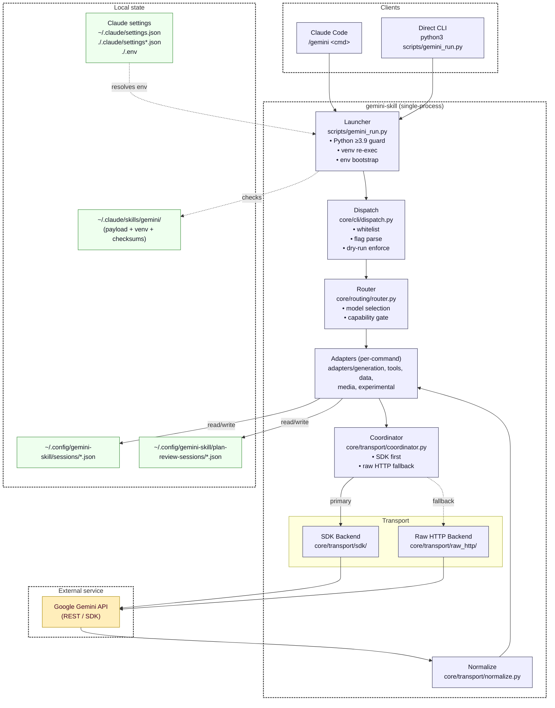

# Documentation Overhaul Implementation Plan

> **For agentic workers:** REQUIRED SUB-SKILL: Use superpowers:subagent-driven-development (recommended) or superpowers:executing-plans to implement this plan task-by-task. Steps use checkbox (`- [ ]`) syntax for tracking.

**Goal:** Audit every source module and rewrite `README.md`, `docs/*.md` (excluding `docs/planning/`), `reference/*.md`, and `SKILL.md` so they match the current code; split oversized files; remove duplicates; add CLI install + usage; add a system-design chapter modeled on `donnemartin/system-design-primer`; refresh every Mermaid diagram + rendered SVG.

**Architecture:** A four-phase pipeline: (1) source audit → produce a fresh ground-truth snapshot; (2) docs audit → diff each file against the snapshot, flag drift, duplication, length; (3) rewrite → edit files and split oversized ones; (4) diagrams → regenerate every SVG and add the new system-design diagram. Each phase ends in a verification gate (grep, link check, `bash scripts/render_diagrams.sh`, `pytest tests/test_documentation_parity.py`).

**Tech Stack:** Python 3.9+, Mermaid CLI (`@mermaid-js/mermaid-cli@10.9.1` via npx), Bash, Markdown.

---

## Scope

### In scope
- `README.md`
- `SKILL.md`
- `docs/*.md` (all 17 files, excluding `docs/planning/`)
- `reference/*.md` (all 23 files)
- `docs/diagrams/*.mmd` + corresponding `*.svg`
- New: `docs/system-design.md` + `docs/diagrams/system-design-overview.mmd` + `.svg`

### Out of scope
- `docs/planning/**` — explicitly excluded by user
- `docs/superpowers/**` — internal planning artifacts
- Source code behavior changes (docs only; if audit reveals bugs, file them separately)

---

## Ground-Truth Source Inventory

Every doc claim must match this inventory. Build the snapshot once in Task 1 and reuse it.

**Source dirs to audit:**
- `core/__init__.py`, `core/types.py`
- `core/adapter/` — `contract.py`, `helpers.py`
- `core/auth/auth.py`
- `core/cli/` — `dispatch.py`, `health_main.py`, `install_main.py`, `update_main.py`, `installer/{api_key_prompt,legacy_migration,payload,settings_merge,venv}.py`
- `core/infra/` — `atomic_write.py`, `checksums.py`, `client.py`, `config.py`, `cost.py`, `errors.py`, `filelock.py`, `mime.py`, `runtime_env.py`, `sanitize.py`, `timeouts.py`
- `core/routing/` — `registry.py`, `router.py`, `tool_state.py`
- `core/state/` — `file_state.py`, `identity.py`, `session_state.py`, `store_state.py`
- `core/transport/` — `_validation.py`, `base.py`, `coordinator.py`, `normalize.py`, `policy.py`
- `core/transport/raw_http/` — `client.py`, `transport.py`
- `core/transport/sdk/` — `async_transport.py`, `client_factory.py`, `transport.py`
- `adapters/data/` — `batch.py`, `cache.py`, `embeddings.py`, `file_search.py`, `files.py`, `token_count.py`
- `adapters/experimental/` — `computer_use.py`, `deep_research.py`
- `adapters/generation/` — `imagen.py`, `live.py`, `multimodal.py`, `plan_review.py`, `streaming.py`, `structured.py`, `text.py`
- `adapters/media/` — `image_gen.py`, `music_gen.py`, `video_gen.py`
- `adapters/tools/` — `code_exec.py`, `function_calling.py`, `maps.py`, `search.py`
- `scripts/` — `gemini_run.py`, `health_check.py`, `render_diagrams.sh`
- `setup/` — `install.py`, `update.py`, `requirements.txt`, `requirements-dev.txt`, `run_tests.sh`, `run_local_install.sh`, `pytest.ini`
- `gemini_skill_install/` — `__init__.py`, `__main__.py`, `cli.py`
- `setup.py`

---

## Current Docs Inventory (pre-overhaul sizes)

### docs/ (total ~163 KB across 17 files)
- `README.md` — 2.3 KB (documentation index)
- `architecture.md` — **21 KB / 425 lines** (split candidate)
- `capabilities.md` — **14 KB / 583 lines** (split candidate)
- `commands.md` — 3.1 KB
- `contributing.md` — **19 KB / 792 lines** (split candidate)
- `design-patterns.md` — **18 KB / 342 lines** (keep; dense reference)
- `flags-reference.md` — 11 KB / 319 lines
- `how-it-works.md` — 2.6 KB (candidate for merge into `architecture.md`)
- `install.md` — 3.2 KB / 152 lines
- `model-routing.md` — 10 KB / 312 lines
- `models-reference.md` — 10 KB / 285 lines
- `python-guide.md` — 13 KB / 541 lines
- `security.md` — 2.6 KB
- `testing.md` — **19 KB / 638 lines** (split candidate)
- `update-sync.md` — 5.8 KB
- `usage.md` — 2.4 KB
- `usage-tour.md` — 2.9 KB

### reference/ (total ~48 KB across 23 files)
All between 1.3 KB and 4.5 KB. Largest: `image_gen.md` (4.5 KB). No splitting needed; audit for accuracy and token compactness.

### diagrams (9 pairs, all `.mmd` + `.svg`)
`architecture-dual-backend`, `auth-resolution`, `backend-priority-matrix`, `command-dispatch-flow`, `coordinator-decision-flow`, `design-patterns-overview`, `install-flow`, `secrets-flow`, `token-optimization-flow`.

---

## Known Issues (observed during audit)

1. **README ↔ docs/install.md** duplicate install instructions (env block, uvx, pipx, clone paths).
2. **README ↔ docs/security.md** duplicate credential/env precedence lists.
3. **docs/how-it-works.md** is a shorter restatement of `docs/architecture.md` sections 1–4.
4. **docs/usage.md ↔ docs/usage-tour.md** overlap on Claude Code vs CLI entry points.
5. **SKILL.md** uses `${CLAUDE_SKILL_DIR}` in sample commands, but `reference/index.md` mixes `${CLAUDE_SKILL_DIR}` and bare `python3 scripts/gemini_run.py` — verify consistency.
6. **Reference pages** — many repeat the SDK-vs-raw-HTTP boilerplate (`Backend-agnostic: this command produces identical output...`). Consolidate into one sentence with link to architecture doc.
7. **No CLI install section** in `README.md` for the non-Claude-Code path (`pip install gemini-skill-install` / `uvx` / clone) distinct from the skill install.
8. **No system-design chapter** exists yet.

---

## File Structure Plan

### New files (created in this plan)
- `docs/system-design.md` — system-design-primer-style chapter covering scalability, availability, consistency, reliability, transport fallbacks, back-pressure, caching, and operational concerns.
- `docs/diagrams/system-design-overview.mmd` — layered system-design diagram.
- `docs/diagrams/system-design-overview.svg` — rendered output.
- `docs/cli.md` — dedicated CLI install + usage reference (split out of `README.md` + `usage.md`).
- `docs/testing-unit.md` — split from `testing.md`: unit tests, fixtures, coverage gates.
- `docs/testing-integration.md` — split from `testing.md`: live-API matrix + skip rules.
- `docs/testing-smoke.md` — split from `testing.md`: clean-install smoke tests.
- `docs/contributing-adapters.md` — split from `contributing.md`: adding an adapter.
- `docs/contributing-workflow.md` — split from `contributing.md`: PR, commit, and release workflow.
- `docs/architecture-transport.md` — split from `architecture.md`: transport, coordinator, policy, raw-HTTP vs SDK.
- `docs/architecture-installer.md` — split from `architecture.md`: installer, payload, venv re-exec, checksums.
- `docs/capabilities-generation.md`, `docs/capabilities-tools.md`, `docs/capabilities-data.md`, `docs/capabilities-media.md`, `docs/capabilities-experimental.md` — split from `capabilities.md` by category.

### Files modified
- `README.md` — trim to: tagline, two install paths (skill + CLI), one example each, link map. Target ≤ 110 lines.
- `SKILL.md` — verify still terse (≤ 35 lines); update only if commands drifted.
- `docs/README.md` — update hub with new split files.
- `docs/architecture.md` — shrink to overview + link to the two split files. Target ~120 lines.
- `docs/capabilities.md` — shrink to capability-matrix overview table + links.
- `docs/contributing.md` — shrink to TL;DR + links.
- `docs/testing.md` — shrink to entry page + links to 3 split files.
- `docs/how-it-works.md` — **delete** (content merged into `docs/architecture.md` and `docs/architecture-transport.md`).
- `docs/usage.md` — reduce to a one-page quickstart that pivots between skill and CLI.
- `docs/usage-tour.md` — keep runnable tour only; remove overlap with `usage.md`.
- `docs/install.md` — focus on skill install; CLI install lives in `docs/cli.md`.
- `docs/security.md`, `docs/design-patterns.md`, `docs/flags-reference.md`, `docs/model-routing.md`, `docs/models-reference.md`, `docs/python-guide.md`, `docs/update-sync.md`, `docs/commands.md` — audit & edit in place.
- All 23 `reference/*.md` — accuracy pass + token compaction pass.
- All 9 existing `docs/diagrams/*.mmd` — re-check against code and regenerate SVG.

### Files deleted
- `docs/how-it-works.md` (merged).

---

## Task Granularity Notes

Doc work does not map cleanly to TDD red/green/refactor. Each task here uses:

1. **Audit step** — grep/read actual source and produce a short note of facts.
2. **Edit step** — rewrite the doc against those facts.
3. **Verification step** — one or more of: link-check, `bash scripts/render_diagrams.sh`, `pytest tests/test_documentation_parity.py`, manual diff review.
4. **Commit step** — one small commit per task.

Parity test reference: `tests/test_documentation_parity.py` already enforces that documented commands match registered ones. Run it after every docs commit.

---

## Phase 1 — Source Audit (produce ground-truth snapshot)

### Task 1: Build the source-truth snapshot

**Files:**
- Create: `docs/superpowers/plans/notes/source-snapshot.md` (working notes, gitignored-eligible; remove at end of plan)

- [ ] **Step 1: Enumerate every public command in the registry**

Run:
```bash
python3 -c "import core.routing.registry as r; [print(c) for c in sorted(r.COMMANDS.keys())]" 2>/dev/null || \
  grep -oE '^[[:space:]]*"[a-z_]+":[[:space:]]*Command\(' core/routing/registry.py | sort -u
```
Expected: 23 command names (text, streaming, plan_review, multimodal, structured, embed, token_count, function_calling, code_exec, search, maps, files, cache, batch, file_search, image_gen, imagen, video_gen, music_gen, computer_use, live, deep_research, help/models if applicable).

Record the exact list in `source-snapshot.md` under heading `## Commands`.

- [ ] **Step 2: Enumerate every shared flag accepted by dispatch**

Run:
```bash
grep -nE "add_argument\(" core/cli/dispatch.py
```
Record flag name, default, and which commands use it in `source-snapshot.md` under `## Flags`.

- [ ] **Step 3: Enumerate every model in the registry**

Run:
```bash
grep -nE '"gemini-|"imagen-|"veo-|"lyria-' core/routing/registry.py | head -80
```
Record model IDs, families, cost tiers, and status in `source-snapshot.md` under `## Models`.

- [ ] **Step 4: Enumerate every env key the runtime bootstrap imports**

Run:
```bash
grep -nE "GEMINI_[A-Z_]+|GOOGLE_[A-Z_]+" core/infra/runtime_env.py core/auth/auth.py
```
Record canonical set in `source-snapshot.md` under `## Env Keys`.

- [ ] **Step 5: Enumerate installer payload**

Run:
```bash
grep -nE "^[A-Z_]+ = |^_CHECKSUMS|^_INSTALL" core/cli/installer/payload.py core/cli/install_main.py
```
Record payload files, checksum filename, excluded dirs in `source-snapshot.md` under `## Installer`.

- [ ] **Step 6: Enumerate every adapter file and the coordinator facade it calls**

Run:
```bash
grep -rnE "from core\.transport import|from core\.infra\.client import" adapters/
```
Record per-command facade import pattern in `source-snapshot.md` under `## Adapter Imports`.

- [ ] **Step 7: Commit the snapshot**

```bash
git add docs/superpowers/plans/notes/source-snapshot.md
git commit -m "docs(plan): add source-truth snapshot for docs overhaul"
```

---

### Task 2: Verify snapshot against parity test

- [ ] **Step 1: Run parity test**

Run: `pytest tests/test_documentation_parity.py -v`
Expected: all pass against current docs. If red, the snapshot must document the discrepancy and the doc rewrite will correct it.

- [ ] **Step 2: Record result**

Append `## Parity baseline (pre-edit)` to `source-snapshot.md` with the pytest summary (pass count or failing test names).

- [ ] **Step 3: Commit (only if changes)**

```bash
git add docs/superpowers/plans/notes/source-snapshot.md
git commit -m "docs(plan): record parity baseline"
```

---

## Phase 2 — Docs Audit (diff each doc vs snapshot)

For each doc, the audit step produces a short diff-note, then rewrite + verify.

### Task 3: Audit README.md and trim duplication

**Files:**
- Modify: `README.md`

- [ ] **Step 1: Diff README against snapshot**

Facts README currently asserts: env precedence list, supported env keys, install commands. Cross-check against `source-snapshot.md` sections `## Env Keys` and `## Installer`. Note mismatches inline in the plan chat or as a short comment block.

- [ ] **Step 2: Rewrite README.md to the following shape**

Replace the file with:

```markdown
[](https://github.com/reshinto/gemini-skill/actions/workflows/ci.yml)
[](https://pypi.org/project/gemini-skill-install/)
[](https://pepy.tech/project/gemini-skill-install)

# gemini-skill

A Gemini API front end with two entry points:

- **Claude Code skill:** `/gemini <command> [args]`
- **Direct CLI:** `python3 scripts/gemini_run.py <command> [args]` or `gemini-skill-install` → installed launcher

Same command surface in both: text, multimodal, structured output, embeddings,
Files API, image/video/music generation, file search, deep research, and
iterative plan review.

## Install

**Claude Code skill (recommended):**
```bash
uvx gemini-skill-install
```
Fallback: `uvx --python 3.13 gemini-skill-install`. See [docs/install.md](docs/install.md).

**Direct CLI (no Claude Code required):**
```bash
pipx install gemini-skill-install     # installs `gemini-skill-install` binary
# or from a clone:
git clone https://github.com/reshinto/gemini-skill.git && cd gemini-skill
python3 -m venv .venv && source .venv/bin/activate
pip install -r setup/requirements.txt
```
See [docs/cli.md](docs/cli.md) for full CLI setup.

## Configure

Set `GEMINI_API_KEY` (only supported key; `GOOGLE_API_KEY` ignored). The
launcher resolves keys in this order: `./.env` → `./.claude/settings.local.json`
→ `./.claude/settings.json` → `~/.claude/settings.json` → process env.

Full list and examples: [docs/security.md](docs/security.md).

## Example

Claude Code:
```text
/gemini text "Explain quantum computing in three sentences"
```

Direct CLI:
```bash
python3 scripts/gemini_run.py text "Explain quantum computing in three sentences"
```

Interactive plan review REPL (CLI only):
```bash
python3 scripts/gemini_run.py plan_review
```

## Docs

- [docs/README.md](docs/README.md) — documentation hub
- [docs/install.md](docs/install.md) — skill install paths and verification
- [docs/cli.md](docs/cli.md) — CLI install and usage
- [docs/usage.md](docs/usage.md) — quickstart across both entry points
- [docs/usage-tour.md](docs/usage-tour.md) — end-to-end examples
- [docs/commands.md](docs/commands.md) — command families
- [docs/architecture.md](docs/architecture.md) — module layout
- [docs/system-design.md](docs/system-design.md) — scalability, reliability, fallbacks
- [docs/design-patterns.md](docs/design-patterns.md) — patterns used
- [docs/security.md](docs/security.md) — secret handling
- [reference/index.md](reference/index.md) — per-command reference

## License

MIT
```

- [ ] **Step 3: Verify link targets exist (pre-split, some will fail — that's expected)**

Run:
```bash
grep -oE '\(docs/[a-z-]+\.md|reference/index\.md\)' README.md | sort -u
```
Cross-check against `ls docs/ reference/` — any link pointing to a file not-yet-created (e.g. `cli.md`, `system-design.md`) will be created in later tasks. Note them; don't fail.

- [ ] **Step 4: Commit**

```bash
git add README.md
git commit -m "docs(readme): trim duplication, add CLI install path, link new docs"
```

---

### Task 4: Create docs/cli.md (new CLI install + usage page)

**Files:**
- Create: `docs/cli.md`

- [ ] **Step 1: Draft docs/cli.md**

Contents (verbatim):

```markdown
# Direct CLI Install and Usage

[← Back to README](../README.md) · [Docs index](README.md) · [Reference index](../reference/index.md)

---

**Last Updated:** 2026-04-18

`gemini-skill` can run independently of Claude Code. This page is the
canonical reference for the CLI path.

## Install options

### Option A: pipx (PyPI)

```bash
pipx install gemini-skill-install
gemini-skill-install --help
```

The `gemini-skill-install` console script is the bootstrap installer package.
For a pure-library CLI without Claude Code integration, use Option B.

### Option B: uvx one-shot

```bash
uvx gemini-skill-install
# pin interpreter if system Python is < 3.9
uvx --python 3.13 gemini-skill-install
```

### Option C: from a clone (developer setup)

```bash
git clone https://github.com/reshinto/gemini-skill.git
cd gemini-skill
python3 -m venv .venv
source .venv/bin/activate
pip install -r setup/requirements.txt

# optional: dev extras
pip install -r setup/requirements-dev.txt
```

From a clone you use the launcher directly:

```bash
python3 scripts/gemini_run.py text "hello"
```

## Configure credentials

Set `GEMINI_API_KEY` using any of the resolution sources (listed in order of precedence):

1. `./.env` — repo-local (highest priority)
2. `./.claude/settings.local.json` — project, not shared
3. `./.claude/settings.json` — project, shared
4. `~/.claude/settings.json` — user-level
5. Existing process env (e.g. exported `GEMINI_API_KEY`)

`.env` template:

```bash
cp .env.example .env
# edit and set GEMINI_API_KEY=...
```

Full details: [security.md](security.md).

## Usage examples

### Single-turn text

```bash
python3 scripts/gemini_run.py text "Summarize the CAP theorem in three sentences"
```

### Multi-turn session

```bash
python3 scripts/gemini_run.py text "Plan a Japan trip" --session travel
python3 scripts/gemini_run.py text "Focus on food"     --continue
```

### Multimodal

```bash
python3 scripts/gemini_run.py multimodal "Describe this PDF" --file ./paper.pdf
```

### Structured JSON

```bash
python3 scripts/gemini_run.py structured "Extract name, date, total" \
  --schema '{"type":"object","properties":{"name":{"type":"string"},"date":{"type":"string"},"total":{"type":"number"}}}' \
  --file ./invoice.png
```

### Plan review REPL

```bash
python3 scripts/gemini_run.py plan_review          # interactive REPL when stdin is a TTY
python3 scripts/gemini_run.py plan_review "Review" # one-shot
```

### Mutating commands (require --execute)

```bash
python3 scripts/gemini_run.py image_gen "A red apple on oak table" --execute
python3 scripts/gemini_run.py video_gen "Timelapse of a sunrise"   --execute
```

Dry-run is the default for any command that writes files or spends quota.

## Verify install

```bash
python3 scripts/health_check.py
```

Expected output sections:
- Python version
- Backend and venv resolution
- API key presence (without printing the key)
- API connectivity probe
- Install integrity (checksum comparison)

## Troubleshooting

- `python3 scripts/gemini_run.py` exits with "requires Python 3.9+" → upgrade the interpreter; the launcher is 2.7-safe and refuses older Python.
- `GEMINI_API_KEY` not picked up → verify current working directory, then run `python3 scripts/health_check.py`.
- Fresh HOME gives no output → see [install.md](install.md) for `${CLAUDE_SKILL_DIR}` setup.

## See also

- [usage.md](usage.md) — Claude Code + CLI quickstart
- [usage-tour.md](usage-tour.md) — end-to-end examples
- [commands.md](commands.md) — command routing
- [reference/index.md](../reference/index.md) — per-command reference
```

- [ ] **Step 2: Verify links**

Run:
```bash
grep -oE '\[[^]]+\]\(([^)]+)\)' docs/cli.md | grep -oE '\([^)]+\)' | tr -d '()' | sort -u
```
Cross-check against `ls docs/ reference/ ../README.md`.

- [ ] **Step 3: Commit**

```bash
git add docs/cli.md
git commit -m "docs(cli): add dedicated CLI install and usage page"
```

---

### Task 5: Audit and rewrite docs/install.md (skill-only focus)

**Files:**
- Modify: `docs/install.md`

- [ ] **Step 1: Audit current content vs source-snapshot**

Read `docs/install.md` and compare every claim to `source-snapshot.md` sections `## Installer` and `## Env Keys`. Identify: (a) duplicated CLI content that now lives in `docs/cli.md`; (b) outdated payload lists; (c) incorrect env key references.

- [ ] **Step 2: Rewrite to focus only on the Claude Code skill install**

Replace sections about CLI setup with a link to `docs/cli.md`. Keep: payload list (regenerated from snapshot), `${CLAUDE_SKILL_DIR}` explanation, troubleshooting. Target ≤ 120 lines.

Preserve the `` reference.

- [ ] **Step 3: Verify**

Run:
```bash
pytest tests/test_documentation_parity.py -v
grep -c "^## " docs/install.md   # should be 4–6 sections
wc -l docs/install.md            # should be <= 120
```

- [ ] **Step 4: Commit**

```bash
git add docs/install.md
git commit -m "docs(install): focus on skill install; move CLI content to docs/cli.md"
```

---

### Task 6: Rewrite docs/usage.md and docs/usage-tour.md to remove overlap

**Files:**
- Modify: `docs/usage.md`
- Modify: `docs/usage-tour.md`

- [ ] **Step 1: Diff the two files**

Run:
```bash
diff <(grep -oE '^##? .+' docs/usage.md) <(grep -oE '^##? .+' docs/usage-tour.md)
```
Identify overlapping sections (both typically have a "Quickstart" or "First run"). Record which content stays in which file.

- [ ] **Step 2: Rewrite docs/usage.md as a pure quickstart**

Target ≤ 90 lines. Content: what the two entry points are, how to run one command in each, where to go for more.

Shape:
```markdown
# Usage Quickstart

[← Back to README](../README.md) · [Docs index](README.md) · [Reference index](../reference/index.md)

`gemini-skill` has one command surface and two entry points.

## Claude Code skill

```text
/gemini text "hello"
```

See [install.md](install.md) for install; [commands.md](commands.md) for the command map.

## Direct CLI

```bash
python3 scripts/gemini_run.py text "hello"
```

See [cli.md](cli.md) for CLI install and [usage-tour.md](usage-tour.md) for end-to-end workflows.

## Shared rules

- Mutating operations require `--execute`.
- Use `--session <id>` or `--continue` for multi-turn text.
- Large responses and generated media save to disk; stdout prints the path.

## Next steps

- [commands.md](commands.md) — all 23 commands by category
- [flags-reference.md](flags-reference.md) — every CLI flag
- [reference/index.md](../reference/index.md) — per-command reference
```

- [ ] **Step 3: Rewrite docs/usage-tour.md to keep only runnable end-to-end workflows**

Remove the quickstart section. Keep 5–8 runnable scenarios (text, session, multimodal, structured JSON, plan_review, image_gen, files). Each scenario shows the same call in both skill + CLI form.

- [ ] **Step 4: Verify**

Run:
```bash
grep -c "```" docs/usage.md       # matched fences must be even
grep -c "```" docs/usage-tour.md  # matched fences must be even
pytest tests/test_documentation_parity.py -v
```

- [ ] **Step 5: Commit**

```bash
git add docs/usage.md docs/usage-tour.md
git commit -m "docs(usage): split quickstart from tour; remove duplicated entry-point content"
```

---

### Task 7: Delete docs/how-it-works.md and merge essentials into architecture.md

**Files:**
- Delete: `docs/how-it-works.md`
- Modify: `docs/architecture.md` (absorb unique content)

- [ ] **Step 1: Diff how-it-works.md vs architecture.md**

Run:
```bash
diff docs/how-it-works.md docs/architecture.md | head -200
```
Identify content unique to `how-it-works.md` that is not already in `architecture.md`.

- [ ] **Step 2: Merge unique content into a new "Runtime path" section in architecture.md**

If a unique section existed (e.g. explicit venv re-exec mention), add it under `## Runtime path` in architecture.md.

- [ ] **Step 3: Delete how-it-works.md**

```bash
git rm docs/how-it-works.md
```

- [ ] **Step 4: Update docs/README.md and any other internal link**

```bash
grep -rln "how-it-works" docs/ README.md reference/
```
Replace each reference with `architecture.md#runtime-path`.

- [ ] **Step 5: Verify no dangling link**

```bash
! grep -rn "how-it-works" docs/ README.md reference/
```
Expected: exit 0 (no matches).

- [ ] **Step 6: Commit**

```bash
git add -A docs/ README.md reference/
git commit -m "docs(architecture): absorb how-it-works; remove duplicated runtime-path doc"
```

---

## Phase 3 — Split Oversized Files

### Task 8: Split docs/testing.md into 3 files

**Files:**
- Create: `docs/testing-unit.md`
- Create: `docs/testing-integration.md`
- Create: `docs/testing-smoke.md`
- Modify: `docs/testing.md` (becomes entry page)

- [ ] **Step 1: Map the current sections**

Run:
```bash
grep -nE "^## " docs/testing.md
```
Record all H2 headings and their line ranges.

- [ ] **Step 2: Move unit-test content to docs/testing-unit.md**

Sections like "Setup", "Run all tests", "Write a unit test", "Coverage gate" go to `testing-unit.md`.

Copy the selected sections verbatim with a new H1 and breadcrumb header.

- [ ] **Step 3: Move integration-test content to docs/testing-integration.md**

Sections about live API calls, env matrix, SDK vs raw-HTTP parity, `GEMINI_LIVE_TESTS` go to `testing-integration.md`.

- [ ] **Step 4: Move smoke-test content to docs/testing-smoke.md**

Sections about clean-HOME install smoke, `gemini-skill-install` end-to-end, version upgrade tests go to `testing-smoke.md`.

- [ ] **Step 5: Shrink docs/testing.md to an entry page**

Content: short overview + link list to the 3 files.

Target ≤ 80 lines.

- [ ] **Step 6: Verify**

```bash
wc -l docs/testing.md docs/testing-unit.md docs/testing-integration.md docs/testing-smoke.md
bash setup/run_tests.sh --help 2>&1 | head -3 || true   # ensure docs references a real command
```
No file should exceed 350 lines.

- [ ] **Step 7: Commit**

```bash
git add docs/testing.md docs/testing-unit.md docs/testing-integration.md docs/testing-smoke.md
git commit -m "docs(testing): split into unit, integration, smoke pages"
```

---

### Task 9: Split docs/contributing.md into 2 files

**Files:**
- Create: `docs/contributing-adapters.md`
- Create: `docs/contributing-workflow.md`
- Modify: `docs/contributing.md` (entry page)

- [ ] **Step 1: Map sections**

```bash
grep -nE "^## " docs/contributing.md
```

- [ ] **Step 2: Move "Adding a new command" / adapter sections to docs/contributing-adapters.md**

Include step-by-step: create adapter file, register in registry, add reference page, add tests.

- [ ] **Step 3: Move PR/commit/release workflow to docs/contributing-workflow.md**

Include: branching, commit style, pre-push hook, running tests locally, release tagging.

- [ ] **Step 4: Shrink docs/contributing.md to a 50–80 line entry page**

List the two split files and the "quick principles" (DRY/YAGNI/TDD).

- [ ] **Step 5: Verify**

```bash
wc -l docs/contributing.md docs/contributing-adapters.md docs/contributing-workflow.md
```
No file > 450 lines.

- [ ] **Step 6: Commit**

```bash
git add docs/contributing.md docs/contributing-adapters.md docs/contributing-workflow.md
git commit -m "docs(contributing): split adapter guide from PR workflow"
```

---

### Task 10: Split docs/architecture.md into 2 files

**Files:**
- Create: `docs/architecture-transport.md`
- Create: `docs/architecture-installer.md`
- Modify: `docs/architecture.md` (overview + links)

- [ ] **Step 1: Move transport sections to docs/architecture-transport.md**

Includes: coordinator, policy, SDK backend, raw-HTTP backend, fallback flow, capability gate, normalization, `GEMINI_IS_SDK_PRIORITY`/`GEMINI_IS_RAWHTTP_PRIORITY`.

Reference these existing diagrams (copy the markdown image tags):
- `architecture-dual-backend.svg`
- `coordinator-decision-flow.svg`
- `backend-priority-matrix.svg`

- [ ] **Step 2: Move installer sections to docs/architecture-installer.md**

Includes: payload manifest, venv management, `${CLAUDE_SKILL_DIR}` semantics, settings merge, legacy migration, SHA-256 checksum wiring.

Reference: `install-flow.svg`.

- [ ] **Step 3: Shrink docs/architecture.md to overview**

Content: system-overview paragraph, "Why SKILL.md is terse", module map (as a table with 2 columns: module / responsibility), `## Runtime path` (from Task 7 merge), links to the two split files and to `system-design.md` (new, created in Task 18).

Target ~130 lines.

- [ ] **Step 4: Verify**

```bash
wc -l docs/architecture.md docs/architecture-transport.md docs/architecture-installer.md
```
No file > 300 lines.

- [ ] **Step 5: Commit**

```bash
git add docs/architecture.md docs/architecture-transport.md docs/architecture-installer.md
git commit -m "docs(architecture): split transport and installer; keep overview in architecture.md"
```

---

### Task 11: Split docs/capabilities.md by category

**Files:**
- Create: `docs/capabilities-generation.md`, `docs/capabilities-tools.md`, `docs/capabilities-data.md`, `docs/capabilities-media.md`, `docs/capabilities-experimental.md`
- Modify: `docs/capabilities.md`

- [ ] **Step 1: Map categories**

Use the command classification from `reference/index.md` and `adapters/` directory structure:
- generation → text, streaming, plan_review, multimodal, structured
- tools → function_calling, code_exec, search, maps
- data → embed, token_count, files, cache, batch, file_search
- media → image_gen, imagen, video_gen, music_gen
- experimental → computer_use, deep_research, live

- [ ] **Step 2: Move each command's capability description into the matching file**

Preserve the existing `Status / Capabilities / Limitations / Use cases / See [...]` schema for each entry.

- [ ] **Step 3: Shrink docs/capabilities.md to a dispatch page**

Content: one-line overview, 5-row table (category → link → commands in that category). Target ≤ 70 lines.

- [ ] **Step 4: Verify**

```bash
wc -l docs/capabilities*.md
pytest tests/test_documentation_parity.py -v
```
Each split file < 250 lines.

- [ ] **Step 5: Commit**

```bash
git add docs/capabilities*.md
git commit -m "docs(capabilities): split by category (generation/tools/data/media/experimental)"
```

---

## Phase 4 — In-Place Audit + Token Pass

### Task 12: Audit remaining docs/*.md files in place

**Files:**
- Modify (audit only, small edits): `docs/commands.md`, `docs/design-patterns.md`, `docs/flags-reference.md`, `docs/model-routing.md`, `docs/models-reference.md`, `docs/python-guide.md`, `docs/security.md`, `docs/update-sync.md`

For each file:

- [ ] **Step 1: Diff claims against source-snapshot**

Example for `docs/flags-reference.md`:
```bash
grep -nE "^### --" docs/flags-reference.md | awk -F'--' '{print $2}' | awk '{print $1}' | sort -u > /tmp/doc-flags.txt
grep -oE 'add_argument\("--[a-z-]+' core/cli/dispatch.py | sed 's/add_argument("//' | sort -u > /tmp/code-flags.txt
diff /tmp/doc-flags.txt /tmp/code-flags.txt
```
Fix any drift (add missing flag, remove retired flag, update default).

Apply the same pattern for each of the 8 files (map each to the right grep target — model ids in `models-reference.md` vs `routing/registry.py`; env keys in `security.md` vs `runtime_env.py`; etc.).

- [ ] **Step 2: Edit each file to fix drift**

One edit per file. Keep edits minimal — this is an accuracy pass, not a rewrite.

- [ ] **Step 3: Verify each file**

```bash
pytest tests/test_documentation_parity.py -v
wc -l docs/*.md
```
No file should be net-longer. Flag any that still exceed 500 lines for a future split.

- [ ] **Step 4: Commit once per file (or one bundled commit if edits are tiny)**

```bash
git add docs/<file>.md
git commit -m "docs(<area>): sync with current source"
```

---

### Task 13: Update docs/README.md hub to reflect new file list

**Files:**
- Modify: `docs/README.md`

- [ ] **Step 1: List all docs after splits**

```bash
ls docs/*.md
```

- [ ] **Step 2: Rewrite the hub**

Group entries by: Start Here, Operational, Design, Contributor, System Design (new), Reference. Every doc file must have a one-line description.

- [ ] **Step 3: Verify no 404s**

```bash
while IFS= read -r link; do
  target="docs/$link"
  [ -e "$target" ] || echo "MISSING: $target"
done < <(grep -oE '\[[^]]+\]\(([a-z-]+\.md)\)' docs/README.md | grep -oE '\([^)]+\)' | tr -d '()')
```
Expected: no "MISSING:" output.

- [ ] **Step 4: Commit**

```bash
git add docs/README.md
git commit -m "docs(hub): refresh index for split files and new system-design page"
```

---

### Task 14: Audit all reference/*.md for accuracy

**Files:**
- Modify: each of the 23 files under `reference/`

- [ ] **Step 1: Enumerate reference files and cross-check flags**

```bash
for f in reference/*.md; do
  cmd=$(basename "$f" .md)
  echo "== $cmd =="
  grep -oE '^- `--[a-z-]+' "$f" | sort -u > /tmp/ref-${cmd}.txt
  # compare to dispatch / adapter argparse definitions
done
```
For each command, verify the list of flags, default model, and examples. Cross-check with `core/routing/registry.py` for model defaults.

- [ ] **Step 2: Fix drift per file**

Apply minimal edits. Keep each file ≤ 5 KB (currently largest is `image_gen.md` at 4.5 KB; that's the cap).

- [ ] **Step 3: Verify parity test stays green**

```bash
pytest tests/test_documentation_parity.py -v
```

- [ ] **Step 4: Commit**

Batch into one commit per logical group (generation / tools / data / media / experimental), five commits total:

```bash
git add reference/text.md reference/streaming.md reference/plan_review.md reference/multimodal.md reference/structured.md
git commit -m "docs(ref): sync generation command references with source"
# repeat for tools/, data/, media/, experimental/
```

---

### Task 15: Token-compaction pass on reference/*.md

**Files:**
- Modify: each `reference/*.md`

- [ ] **Step 1: Identify repeated boilerplate**

```bash
grep -rn "Backend-agnostic" reference/ | wc -l
```
Expected: one hit per file → 23 repeats.

- [ ] **Step 2: Add a single shared line in reference/index.md and remove the per-file repetition**

Append to `reference/index.md` under a new `## Backend note` section:

```markdown
## Backend note

Every command produces identical output whether the SDK or raw HTTP backend
handled the call. Backend selection happens in the coordinator; adapters are
backend-agnostic. See [architecture-transport.md](../docs/architecture-transport.md).
```

Then remove the per-file `Backend-agnostic:` sentence from each `reference/*.md` (keep the `---` separator).

- [ ] **Step 3: Audit each reference file for further token waste**

- Remove trailing navigation lines that duplicate the Back-link header.
- Collapse `## Default model` and `## Large responses` sections that are already in flags-reference/usage.md — link instead.
- Keep: command-specific flags, examples, edge cases, preview status.

Target: shave ~10–15% off total `reference/*.md` byte count.

- [ ] **Step 4: Verify**

```bash
wc -c reference/*.md
pytest tests/test_documentation_parity.py -v
```
Total should be below pre-edit baseline (48 068 bytes).

- [ ] **Step 5: Commit**

```bash
git add reference/
git commit -m "docs(ref): compact per-command reference pages; consolidate backend boilerplate"
```

---

### Task 16: Audit SKILL.md

**Files:**
- Modify (minimal if at all): `SKILL.md`

- [ ] **Step 1: Verify size budget**

```bash
wc -c SKILL.md
```
Current: ~1 KB. Budget: ≤ 1.5 KB (from `docs/architecture.md` token-economics rationale).

- [ ] **Step 2: Verify quick commands list matches current registry**

```bash
grep -oE "^- \`[a-z_]+" SKILL.md | sed 's/- `//' > /tmp/skill-cmds.txt
cat /tmp/skill-cmds.txt
```
The list is intentionally a subset (~7 commands). Verify each listed command still exists in `source-snapshot.md ## Commands`.

- [ ] **Step 3: Verify paths and placeholders**

`${CLAUDE_SKILL_DIR}/scripts/gemini_run.py` and `${CLAUDE_SKILL_DIR}/reference/*.md` must be the install-time layout.

```bash
grep -n "CLAUDE_SKILL_DIR" SKILL.md
ls -d ~/.claude/skills/gemini/scripts 2>/dev/null || true
```

- [ ] **Step 4: Edit only if drift found**

Keep the file at or under 35 lines. Do not expand the command list — the terseness is deliberate.

- [ ] **Step 5: Commit (only if changes)**

```bash
git add SKILL.md
git commit -m "docs(skill): sync quick-commands with registry"
```

---

## Phase 5 — System Design Chapter

### Task 17: Draft docs/system-design.md

**Files:**
- Create: `docs/system-design.md`

Base the structure on `donnemartin/system-design-primer`: scalability, availability, consistency, reliability, latency vs throughput, caching, back-pressure, graceful degradation. Specialize each section to gemini-skill.

- [ ] **Step 1: Draft the file with these sections**

```markdown
# System Design

[← Back to README](../README.md) · [Docs index](README.md) · [Reference index](../reference/index.md)

---

**Last Updated:** 2026-04-18

A system-design view of gemini-skill. Adapts the mental model of
[donnemartin/system-design-primer](https://github.com/donnemartin/system-design-primer)
to a CLI-first client that brokers calls to a remote LLM service.


<sub>Source: [`docs/diagrams/system-design-overview.mmd`](diagrams/system-design-overview.mmd)</sub>

## 1. System context

- **Clients:** Claude Code VSCode extension (via `/gemini`) and human users (via `scripts/gemini_run.py`).
- **Service:** Google Gemini REST API (and Vertex-family SDKs wrapping it).
- **Scope of our system:** launcher → coordinator → dual-backend transport → adapters → Gemini.

Nothing in our system is a horizontally scaled service. The relevant
system-design axes here are *reliability*, *failure isolation*,
*cost efficiency*, and *local state management* — not load balancing.

## 2. Reliability and fallback

Two transports, one unified facade. When the SDK backend raises a
`BackendUnavailableError` (missing `google-genai`, unsupported capability,
protocol-level error), the coordinator retries through the raw-HTTP backend.
See [architecture-transport.md](architecture-transport.md).

Failure modes we design against:
- SDK import errors (platform-specific wheels, e.g. PyTorch on 3.14t).
- SDK version drift when a Gemini feature is released before the SDK ships.
- Transient 5xx errors from Gemini — retry/backoff in transport layer.
- Network partitions — surfaced with a structured error, never silently retried forever.

## 3. Availability

- No multi-region story: we are a client, not a server.
- The only "uptime" target is: `scripts/gemini_run.py` must respond within the user's patience window (~30 s) for normal calls, or stream output as soon as the first token arrives.
- `health_check.py` exposes a Chrome-DevTools-style quick diagnostics path: Python version → backend → API key → API connectivity → install integrity.

## 4. Consistency

- **Session state is durable:** `~/.config/gemini-skill/sessions/<id>.json` + `~/.config/gemini-skill/plan-review-sessions/<id>.json` are the source of truth for multi-turn history. Writes are atomic (`core/infra/atomic_write.py`).
- **No shared-storage consistency problems:** single-process CLI. Locking is handled via `core/infra/filelock.py` only where the installer concurrently writes `settings.json`.

## 5. Latency and throughput

- **Streaming commands** (`streaming`, `live`) reduce time-to-first-token.
- **Token-count probes** (`token_count`) let callers estimate cost before committing to a `text` call.
- **Large-response handling:** responses > 50 KB are written to disk and only a file path + size is printed — prevents terminal blowups and protects memory.

## 6. Cost and rate limits

- Default model is `gemini-2.5-flash` (affordable tier). Use cases requiring the Pro model must pass `--model` explicitly.
- `--dry-run` is the default for mutating commands (image, video, music, batch) to prevent wasted API spend.
- Cost estimation lives in `core/infra/cost.py` and is printed in dry-run mode where possible.

## 7. Caching

- **Gemini cached input tokens:** exposed via the `cache` command (see [capabilities-data.md](capabilities-data.md)).
- **File search cache:** the hosted RAG command uses Gemini's server-side cache; we don't maintain our own.
- **No local LRU or disk cache on outputs:** outputs are cheap to re-request; cached inputs are the real savings.

## 8. Security

Single-key authentication (`GEMINI_API_KEY`). Resolution order is deliberate:
local project env wins over user-level wins over process env. This keeps
multi-project setups isolated without leakage. See [security.md](security.md).

## 9. Observability

- `scripts/health_check.py` — structured health probe (JSON when piped).
- Install integrity via SHA-256 checksums (`core/infra/checksums.py`, wired into `install_main.py` and `health_main.py`).
- Errors normalized through `core/infra/errors.py` so the two backends emit comparable failure payloads.

## 10. Trade-offs

| Axis | Choice | Cost | Benefit |
|------|--------|------|---------|
| SDK vs raw HTTP | Run both, SDK primary | Extra code + parity tests | Survives SDK gaps and unsupported platforms |
| Skill vs CLI | Support both from one codebase | Dual-entrypoint tests | Same surface, two audiences |
| `SKILL.md` terseness | Minimal; point to `reference/*.md` | Extra on-demand reads | Keeps session-start context tiny |
| Dry-run default | User must pass `--execute` for mutations | One more flag to type | Prevents accidental cost |
| Local session files | No server-side history | Migration is per-machine | Zero state in the cloud beyond the API |

## See also

- [architecture.md](architecture.md) — module map
- [architecture-transport.md](architecture-transport.md) — dual-backend internals
- [architecture-installer.md](architecture-installer.md) — payload and install integrity
- [design-patterns.md](design-patterns.md) — implementation-level pattern catalog
```

- [ ] **Step 2: Verify the new file renders cleanly**

```bash
grep -c "```" docs/system-design.md   # should be even
grep -oE '\[[^]]+\]\(([^)]+)\)' docs/system-design.md | head -30
```

- [ ] **Step 3: Commit (defer SVG step to Task 18)**

```bash
git add docs/system-design.md
git commit -m "docs(system-design): add system-design chapter modeled on system-design-primer"
```

---

### Task 18: Create docs/diagrams/system-design-overview.mmd + SVG

**Files:**
- Create: `docs/diagrams/system-design-overview.mmd`
- Create (via render script): `docs/diagrams/system-design-overview.svg`

- [ ] **Step 1: Write the Mermaid source**



- [ ] **Step 2: Render SVG**

```bash
bash scripts/render_diagrams.sh system-design-overview
```

Expected stdout: `[render] system-design-overview.mmd -> system-design-overview.svg` then `[render] done`.

- [ ] **Step 3: Verify output file exists**

```bash
ls -la docs/diagrams/system-design-overview.svg
```

- [ ] **Step 4: Commit**

```bash
git add docs/diagrams/system-design-overview.mmd docs/diagrams/system-design-overview.svg
git commit -m "docs(diagrams): add system-design-overview"
```

---

## Phase 6 — Regenerate All Mermaid SVGs

### Task 19: Audit every existing Mermaid source against current code

**Files:**
- Modify (audit only; edit only if drift): `docs/diagrams/architecture-dual-backend.mmd`, `docs/diagrams/auth-resolution.mmd`, `docs/diagrams/backend-priority-matrix.mmd`, `docs/diagrams/command-dispatch-flow.mmd`, `docs/diagrams/coordinator-decision-flow.mmd`, `docs/diagrams/design-patterns-overview.mmd`, `docs/diagrams/install-flow.mmd`, `docs/diagrams/secrets-flow.mmd`, `docs/diagrams/token-optimization-flow.mmd`

For each diagram:

- [ ] **Step 1: Read the `.mmd` and the doc section that references it**

Example for `architecture-dual-backend`:
```bash
grep -rln "architecture-dual-backend" docs/
head -60 docs/diagrams/architecture-dual-backend.mmd
```

- [ ] **Step 2: Compare module/file labels against source-snapshot**

Every `coordinator.py`, `router.py`, `policy.py`, `sdk/transport.py`, `raw_http/transport.py`, installer payload must exist. Update labels if anything was renamed.

- [ ] **Step 3: Edit the `.mmd` only if a label is wrong**

- [ ] **Step 4: Re-render**

```bash
bash scripts/render_diagrams.sh <diagram-name>
```

- [ ] **Step 5: Commit per diagram (or one batch if no edits were needed)**

```bash
git add docs/diagrams/<name>.mmd docs/diagrams/<name>.svg
git commit -m "docs(diagrams): refresh <name>"
```

---

### Task 20: Re-render every SVG for consistency

- [ ] **Step 1: Render all**

```bash
bash scripts/render_diagrams.sh
```
Expected: `[render] done` with 10 filenames (9 existing + 1 new).

- [ ] **Step 2: Verify all pairs exist**

```bash
for f in docs/diagrams/*.mmd; do
  svg="${f%.mmd}.svg"
  [ -f "$svg" ] || echo "MISSING: $svg"
done
```
Expected: no "MISSING:" output.

- [ ] **Step 3: Commit if any SVG changed**

```bash
git add docs/diagrams/*.svg
git diff --cached --name-only
git commit -m "docs(diagrams): re-render all SVGs for a clean baseline" || echo "nothing to commit"
```

---

## Phase 7 — Final Verification

### Task 21: Cross-link audit

- [ ] **Step 1: Find broken internal links**

```bash
python3 - <<'PY'
import pathlib, re, sys
root = pathlib.Path(".")
md_files = list(root.glob("README.md")) + list(root.glob("SKILL.md")) + \
           list(root.glob("docs/**/*.md")) + list(root.glob("reference/**/*.md"))
md_files = [p for p in md_files if "docs/planning" not in str(p) and "docs/superpowers" not in str(p)]
broken = []
for f in md_files:
    text = f.read_text(encoding="utf-8")
    for m in re.finditer(r"\]\(([^)#]+\.md)(#[^)]*)?\)", text):
        target = (f.parent / m.group(1)).resolve()
        if not target.exists():
            broken.append((str(f), m.group(1)))
for src, tgt in broken:
    print(f"BROKEN: {src} -> {tgt}")
sys.exit(0 if not broken else 1)
PY
```
Expected: exit 0.

- [ ] **Step 2: Find broken diagram references**

```bash
grep -rnE '!\[[^]]+\]\(diagrams/[a-z-]+\.svg\)' docs/ | while IFS=: read -r f line rest; do
  svg=$(echo "$rest" | grep -oE 'diagrams/[a-z-]+\.svg')
  [ -f "docs/$svg" ] || echo "BROKEN: $f:$line -> docs/$svg"
done
```
Expected: no output.

- [ ] **Step 3: Fix any findings and commit**

```bash
git add -A && git commit -m "docs: fix broken cross-links"
```
(Skip if nothing found.)

---

### Task 22: Full verification gates

- [ ] **Step 1: Documentation parity test**

```bash
pytest tests/test_documentation_parity.py -v
```
Expected: pass.

- [ ] **Step 2: Full test suite**

```bash
bash setup/run_tests.sh
```
Expected: all pass, 100% coverage gate intact.

- [ ] **Step 3: Sizes are reasonable**

```bash
wc -l docs/*.md
```
No file > 500 lines. Most ≤ 300.

- [ ] **Step 4: Byte total for reference/ decreased**

```bash
wc -c reference/*.md | tail -1
```
Compare to pre-overhaul baseline (~48 068 bytes). Expected: smaller.

- [ ] **Step 5: SKILL.md byte budget respected**

```bash
wc -c SKILL.md
```
Expected: ≤ 1500 bytes (ideally ~1000).

- [ ] **Step 6: Every diagram pair present**

```bash
ls docs/diagrams/*.mmd | wc -l       # expect 10
ls docs/diagrams/*.svg | wc -l       # expect 10
```

- [ ] **Step 7: Commit gate results (optional summary)**

```bash
git log --oneline -20
```

---

### Task 23: Remove working notes and open PR

- [ ] **Step 1: Delete the working snapshot**

```bash
git rm docs/superpowers/plans/notes/source-snapshot.md
```

- [ ] **Step 2: Commit cleanup**

```bash
git commit -m "docs(plan): remove source-snapshot working notes"
```

- [ ] **Step 3: Open PR**

```bash
git push -u origin HEAD
gh pr create --title "docs: overhaul docs, split oversized files, add system design" --body "$(cat <<'EOF'
## Summary
- Audited every `core/`, `adapters/`, `scripts/`, `setup/`, `gemini_skill_install/` module against all `docs/*.md` + `reference/*.md` + `README.md` + `SKILL.md`
- Split oversized files: `testing.md` → 3, `contributing.md` → 2, `architecture.md` → 2, `capabilities.md` → 5
- Removed duplication between README / install / usage / how-it-works; deleted `docs/how-it-works.md`
- Added `docs/cli.md` (direct CLI install + usage) and `docs/system-design.md` (modeled on system-design-primer)
- Regenerated all diagram SVGs; added `system-design-overview.{mmd,svg}`
- Token-compacted reference pages; verified SKILL.md terseness is preserved

## Test plan
- [ ] `pytest tests/test_documentation_parity.py -v`
- [ ] `bash setup/run_tests.sh`
- [ ] `bash scripts/render_diagrams.sh` (re-renders every SVG cleanly)
- [ ] Broken-link audit script in Task 21 returns 0
- [ ] Manual spot-check: open `README.md`, `docs/system-design.md`, one reference page
EOF
)"
```

---

## Self-Review Checklist (run before declaring the plan complete)

**1. Spec coverage.** Every user requirement maps to at least one task:
- Read entire source code ↦ Task 1 (snapshot) + every audit step referring back to it
- Update docs/*.md ↦ Tasks 3–15
- Update README.md ↦ Task 3
- Update Mermaid diagrams + SVGs ↦ Tasks 18–20
- Skip docs/planning/ ↦ stated in Scope
- Usage examples for skill + CLI ↦ Tasks 4, 6 (usage.md, cli.md, usage-tour.md)
- CLI installation instructions ↦ Tasks 3, 4
- Remove duplicates, inconsistencies ↦ Tasks 3, 6, 7, 12
- Split long files ↦ Tasks 8–11
- System design explanation + diagram based on system-design-primer ↦ Tasks 17, 18
- Audit SKILL.md and reference/ for latest info + token optimization ↦ Tasks 14, 15, 16

**2. Placeholder scan.** Every edit step shows actual content or a concrete diff instruction. No "TBD" / "similar to X" / "fill in".

**3. Type/path consistency.** Every file path used in later tasks was introduced in an earlier task's "Files" block. New files created in Phase 3 (splits) are the targets of link-update steps in Phase 4. The system-design file referenced in Task 3's README rewrite is created in Task 17.
