# System Design

[← Back to README](../README.md) · [Docs index](README.md) · [Reference index](../reference/index.md)

---

**Last Updated:** 2026-04-18

A system-design view of `gemini-skill`. The frame is adapted from
[donnemartin/system-design-primer](https://github.com/donnemartin/system-design-primer)
— but specialized to a client-side CLI that brokers calls to a remote LLM service rather than a horizontally scaled web service.

Source: [`docs/diagrams/system-design-overview.mmd`](diagrams/system-design-overview.mmd) — regenerate with `bash scripts/render_diagrams.sh system-design-overview`

## 1. System context

- **Actors:** a human user, optionally mediated by the Claude Code IDE extension.
- **Clients:** two entry points into one process — the Claude Code skill (`/gemini ...`) and the direct CLI (`python3 scripts/gemini_run.py ...` or the `gemini-skill-install` launcher).
- **External service:** the Google Gemini REST API, reached through either the `google-genai` SDK or our own raw-HTTP client.
- **Scope of our system:** launcher → dispatch → router → transport coordinator → adapters → Gemini API, plus local state (sessions, settings, install payload) on disk.

`gemini-skill` is not a multi-node service. The relevant system-design axes are *reliability*, *failure isolation*, *cost efficiency*, and *local state management* — not load balancing, sharding, or consensus.

## 2. Reliability and fallback

Two transports, one unified facade.

- **Primary path:** SDK transport (`core/transport/sdk/`) uses the pinned `google-genai` client. Most commands run here.
- **Fallback path:** raw-HTTP transport (`core/transport/raw_http/`) talks directly to `generativelanguage.googleapis.com` and supports every stable surface.
- **Decision point:** the coordinator (`core/transport/coordinator.py`) picks SDK by default. It falls through to raw-HTTP on `BackendUnavailableError` (missing SDK, unsupported capability, protocol-level error). Priority can be inverted with `GEMINI_IS_RAWHTTP_PRIORITY=true`.

Failure modes the dual-backend design handles:

| Failure mode | Why it happens | How the system survives |
|--------------|----------------|-------------------------|
| SDK import error | Python version, platform wheels (e.g. Python 3.14t + pydantic-core) | Coordinator falls through to raw HTTP |
| SDK behind the API | New Gemini feature not yet in SDK | Raw-HTTP backend implements the surface directly |
| Transient 5xx | Network / upstream | Both transports honor retry + backoff policy |
| Invalid credentials | Bad or missing `GEMINI_API_KEY` | Health check surfaces this before commands run |

See [architecture-transport.md](architecture-transport.md) for the full decision flow.

## 3. Availability

We are a client, not a server — there is no "uptime" metric per region. The availability target reduces to:

- `scripts/gemini_run.py` must produce output within the user's patience window, or stream as soon as the first token arrives.
- `scripts/health_check.py` is the quick-diagnostic path: Python version → backend → API key → API connectivity → install integrity. Operators run it on a fresh machine to validate the install end-to-end.

## 4. Consistency

- **Session state is durable and local.** Text sessions live at `~/.config/gemini-skill/sessions/<id>.json`; `plan_review` sessions at `~/.config/gemini-skill/plan-review-sessions/<id>.json`. Writes go through `core/infra/atomic_write.py` (write to temp → `os.rename`), so a crashed interpreter cannot leave a half-written JSON file.
- **No cross-process consistency:** a single launcher invocation owns the session file for the duration of the call. Concurrency between multiple CLI invocations is possible but not designed for — if two shells write the same session, last write wins.
- **Installer concurrency:** the installer is the only place with real concurrent-write risk (multi-shell installs merging `~/.claude/settings.json`). `core/infra/filelock.py` serializes this path.

## 5. Latency and throughput

- **Streaming** (`streaming`, `live`) reduces time-to-first-token, which matters most when prompts are long or models are slow.
- **Token-count probes** (`token_count`) let callers estimate cost before committing to a `text` call.
- **Large responses** > 50 KB are written to disk; stdout prints only the path and size. This protects the terminal and keeps memory usage bounded.

## 6. Cost and rate limits

- **Default model is `gemini-2.5-flash`** (affordable tier). Pro-tier reasoning requires an explicit `--model` override.
- **Dry-run is the default** for every mutating command (`image_gen`, `imagen`, `video_gen`, `music_gen`, `batch` writes, file uploads/deletes). Callers must pass `--execute` (or `-x`) to actually spend quota.
- **Cost estimation** (`core/infra/cost.py`) is printed in dry-run summaries where the per-token price is known.
- **Rate limits** are not bucketed client-side — the coordinator surfaces 429 responses through normalized error types so callers can decide to retry or bail.

## 7. Caching

Three caches exist; we own none of them:

| Layer | Owned by | Purpose |
|-------|----------|---------|
| Gemini input cache | Gemini (server) | Cache expensive system prompts / context across calls — exposed via the `cache` command |
| File-search index | Gemini (server) | Hosted RAG over uploaded files — exposed via `file_search` |
| Claude Code skill loader | Claude Code | Caches `SKILL.md` for the session; the `reference/` pages are read on demand |

There is no local LRU of output responses. Outputs are cheap to re-request; cached *inputs* are the real savings.

## 8. Security

- **Single-key auth.** `GEMINI_API_KEY` is the only honored secret name. `GOOGLE_API_KEY` is explicitly ignored — this prevents accidental leakage between Google-family SDKs.
- **Resolution precedence** (lowest → highest):
  1. existing process env
  2. `~/.claude/settings.json`
  3. `./.claude/settings.json`
  4. `./.claude/settings.local.json`
  5. `./.env`
  Later sources update earlier ones, so a project-local `.env` always wins. This keeps multi-project setups isolated without requiring global shell config.
- **No telemetry.** The skill never phones home.
- **Install integrity.** SHA-256 checksums (`core/infra/checksums.py`) are written at install time and verified by the health check.

See [security.md](security.md) and [architecture-installer.md](architecture-installer.md) for specifics.

## 9. Observability

- `scripts/health_check.py` — structured probe of every critical surface.
- `core/infra/errors.py` — normalizes exceptions across both backends so failure payloads are comparable regardless of which transport handled the call.
- Adapter outputs standardize on the `GeminiResponse` dict shape produced by `core/transport/normalize.py`.

There are no metrics emitters; the CLI does not ship with Prometheus or OpenTelemetry. This is deliberate for a local tool.

## 10. Trade-offs

| Axis | Choice | Cost | Benefit |
|------|--------|------|---------|
| SDK vs raw HTTP | Run both, SDK primary | Extra code + parity tests | Survives SDK gaps and unsupported platforms |
| Skill vs CLI | Support both from one codebase | Dual-entrypoint tests and docs | Same surface, two audiences |
| `SKILL.md` terseness | Minimal; point to `reference/*.md` | Extra on-demand reads | Tiny session-start context |
| Dry-run default | Mutation must opt in with `--execute` | One more flag to type | Prevents accidental API spend |
| Local session files | No server-side history | State is per-machine | Zero cloud state beyond the API |
| Python 3.9+ floor | Refuse older interpreters at the launcher | Small user fraction locked out | Modern syntax, fewer compatibility shims |

## 11. What would change at 10× / 100× scale

`gemini-skill` is intentionally shaped for a single user × many projects. If we grew to "many users per org, many orgs" we would add:

- **Shared caching layer** (Redis or similar) for `cache` results across teammates, with a keying strategy derived from prompt + context hash.
- **Centralized secret store** integration (AWS Secrets Manager, 1Password CLI) replacing the `.env`-first precedence.
- **Fleet health metrics** — aggregated `health_check.py` output via an OpenTelemetry collector.
- **Rate-limit budgeting** — quota pools shared across a team rather than per-user.
- **Audit log** — who ran which mutating command with which model.

None of these exist today, and the code is organized so each could be added behind the coordinator facade without touching the 20 per-command adapters.

## See also

- [architecture.md](architecture.md) — module map and runtime path
- [architecture-transport.md](architecture-transport.md) — dual-backend internals
- [architecture-installer.md](architecture-installer.md) — install pipeline and integrity
- [design-patterns.md](design-patterns.md) — implementation-level pattern catalog
- [security.md](security.md) — secret handling details
- [system-design-primer](https://github.com/donnemartin/system-design-primer) — source of the general frame
